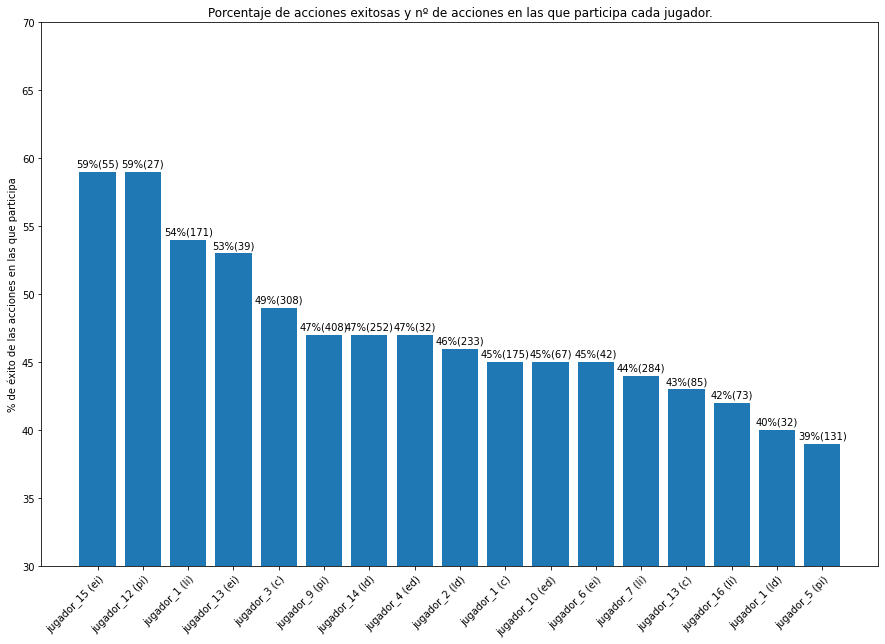
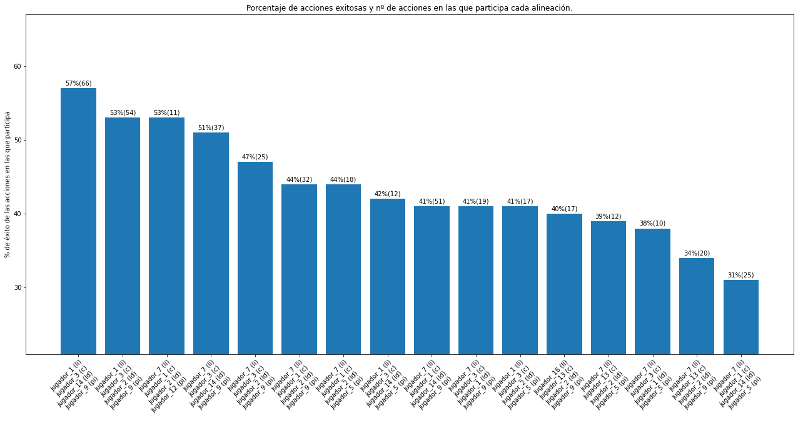
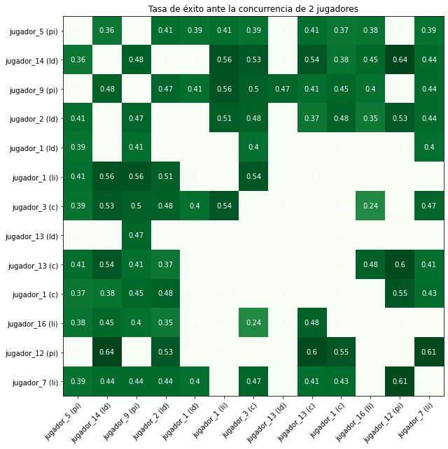
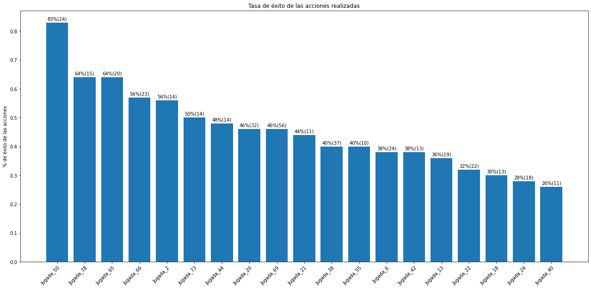
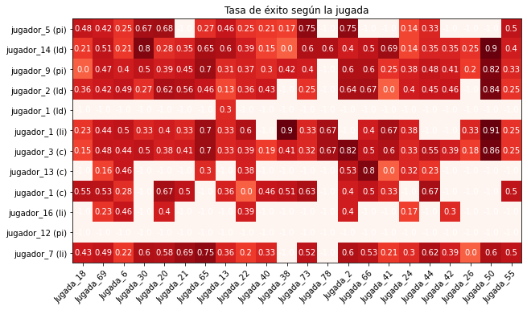

# Análisis estadístico del rendimiento de las situaciones tácticas ofensivas y su relación con los jugadores que participan en ellas
Trabajo fin de Diploma Universitario en Analítica Avanzada en Balonmano.


```python
import turicreate
from turicreate import SArray
import matplotlib.pyplot as plt
import itertools
import numpy as np
TacticaSF = turicreate.SFrame.read_csv('PrimeraVuelta_ofuscado.csv')

%matplotlib inline
```


<pre>Finished parsing file /mnt/d/Balonmano/SPORTS DATA CAMPUS/Diploma Universitario de Analítica en Balonmano/Trabajo fin de Diploma/PrimeraVuelta_ofuscado.csv</pre>


<pre>Parsing completed. Parsed 100 lines in 0.054977 secs.</pre>


    ------------------------------------------------------
    Inferred types from first 100 line(s) of file as 
    column_type_hints=[str,int,int,str,str,str,str]
    If parsing fails due to incorrect types, you can correct
    the inferred type list above and pass it to read_csv in
    the column_type_hints argument
    ------------------------------------------------------


<pre>Finished parsing file /mnt/d/Balonmano/SPORTS DATA CAMPUS/Diploma Universitario de Analítica en Balonmano/Trabajo fin de Diploma/PrimeraVuelta_ofuscado.csv</pre>


<pre>Parsing completed. Parsed 745 lines in 0.061644 secs.</pre>


**745 acciones analizadas**


```python
TacticaSF.show()
```


<pre>Materializing SFrame</pre>


<html>                 <body>                     <iframe style="border:0;margin:0" width="1000" height="2400" srcdoc='<html lang="en">                         <head>                             <script src="https://cdnjs.cloudflare.com/ajax/libs/vega/5.4.0/vega.js"></script>                             <script src="https://cdnjs.cloudflare.com/ajax/libs/vega-embed/4.0.0/vega-embed.js"></script>                             <script src="https://cdnjs.cloudflare.com/ajax/libs/vega-tooltip/0.5.1/vega-tooltip.min.js"></script>                             <link rel="stylesheet" type="text/css" href="https://cdnjs.cloudflare.com/ajax/libs/vega-tooltip/0.5.1/vega-tooltip.min.css">                             <style>                             .vega-actions > a{                                 color:white;                                 text-decoration: none;                                 font-family: "Arial";                                 cursor:pointer;                                 padding:5px;                                 background:#AAAAAA;                                 border-radius:4px;                                 padding-left:10px;                                 padding-right:10px;                                 margin-right:5px;                             }                             .vega-actions{                                 margin-top:20px;                                 text-align:center                             }                            .vega-actions > a{                                 background:#999999;                            }                             </style>                         </head>                         <body>                             <div id="vis">                             </div>                             <script>                                 var vega_json = "{\"$schema\": \"https://vega.github.io/schema/vega/v4.json\", \"metadata\": {\"bubbleOpts\": {\"showAllFields\": false, \"fields\": [{\"field\": \"left\"}, {\"field\": \"right\"}, {\"field\": \"count\"}, {\"field\": \"label\"}]}}, \"width\": 800, \"height\": 2180, \"padding\": 8, \"data\": [{\"name\": \"pts_store\"}, {\"name\": \"source_2\", \"values\": [{\"a\": 0, \"title\": \"Nombre\", \"num_row\": 745, \"type\": \"str\", \"num_unique\": 97, \"num_missing\": 0, \"categorical\": [{\"label\": \"Acci\\u00f3n de ataque (1)\", \"label_idx\": 0, \"count\": 15, \"percentage\": \"2.01342%\"}, {\"label\": \"Acci\\u00f3n de ataque (10)\", \"label_idx\": 1, \"count\": 15, \"percentage\": \"2.01342%\"}, {\"label\": \"Acci\\u00f3n de ataque (11)\", \"label_idx\": 2, \"count\": 15, \"percentage\": \"2.01342%\"}, {\"label\": \"Acci\\u00f3n de ataque (17)\", \"label_idx\": 3, \"count\": 15, \"percentage\": \"2.01342%\"}, {\"label\": \"Acci\\u00f3n de ataque (18)\", \"label_idx\": 4, \"count\": 15, \"percentage\": \"2.01342%\"}, {\"label\": \"Acci\\u00f3n de ataque (19)\", \"label_idx\": 5, \"count\": 15, \"percentage\": \"2.01342%\"}, {\"label\": \"Acci\\u00f3n de ataque (2)\", \"label_idx\": 6, \"count\": 15, \"percentage\": \"2.01342%\"}, {\"label\": \"Acci\\u00f3n de ataque (21)\", \"label_idx\": 7, \"count\": 15, \"percentage\": \"2.01342%\"}, {\"label\": \"Acci\\u00f3n de ataque (7)\", \"label_idx\": 8, \"count\": 15, \"percentage\": \"2.01342%\"}, {\"label\": \"Acci\\u00f3n de ataque (14)\", \"label_idx\": 9, \"count\": 14, \"percentage\": \"1.87919%\"}, {\"label\": \"Other (87 labels)\", \"label_idx\": 10, \"count\": 596, \"percentage\": \"80%\"}], \"numeric\": []}, {\"a\": 1, \"title\": \"Posici\\u00f3n\", \"num_row\": 745, \"type\": \"integer\", \"num_unique\": 739, \"num_missing\": 0, \"mean\": 1747312.483221, \"min\": 16920.0, \"max\": 6053000.0, \"median\": 1372600.0, \"stdev\": 1415353.832244, \"numeric\": [{\"left\": 14372, \"right\": 316900, \"count\": 84}, {\"left\": 316900, \"right\": 619428, \"count\": 72}, {\"left\": 619428, \"right\": 921956, \"count\": 62}, {\"left\": 921956, \"right\": 1224484, \"count\": 104}, {\"left\": 1224484, \"right\": 1527012, \"count\": 91}, {\"left\": 1527012, \"right\": 1829540, \"count\": 90}, {\"left\": 1829540, \"right\": 2132068, \"count\": 70}, {\"left\": 2132068, \"right\": 2434596, \"count\": 27}, {\"left\": 2434596, \"right\": 2737124, \"count\": 16}, {\"left\": 2737124, \"right\": 3039652, \"count\": 11}, {\"left\": 3039652, \"right\": 3342180, \"count\": 3}, {\"left\": 3342180, \"right\": 3644708, \"count\": 6}, {\"left\": 3644708, \"right\": 3947236, \"count\": 12}, {\"left\": 3947236, \"right\": 4249764, \"count\": 15}, {\"left\": 4249764, \"right\": 4552292, \"count\": 16}, {\"left\": 4552292, \"right\": 4854820, \"count\": 25}, {\"left\": 4854820, \"right\": 5157348, \"count\": 14}, {\"left\": 5157348, \"right\": 5459876, \"count\": 14}, {\"left\": 5459876, \"right\": 5762404, \"count\": 8}, {\"left\": 5762404, \"right\": 6064932, \"count\": 5}, {\"start\": 14372, \"stop\": 6064932, \"step\": 302528}], \"categorical\": []}, {\"a\": 2, \"title\": \"Duraci\\u00f3n\", \"num_row\": 745, \"type\": \"integer\", \"num_unique\": 286, \"num_missing\": 0, \"mean\": 10868.724832, \"min\": 3000.0, \"max\": 28040.0, \"median\": 10240.0, \"stdev\": 3971.736065, \"numeric\": [{\"left\": 2740, \"right\": 4020, \"count\": 7}, {\"left\": 4020, \"right\": 5300, \"count\": 28}, {\"left\": 5300, \"right\": 6580, \"count\": 66}, {\"left\": 6580, \"right\": 7860, \"count\": 81}, {\"left\": 7860, \"right\": 9140, \"count\": 94}, {\"left\": 9140, \"right\": 10420, \"count\": 116}, {\"left\": 10420, \"right\": 11700, \"count\": 73}, {\"left\": 11700, \"right\": 12980, \"count\": 70}, {\"left\": 12980, \"right\": 14260, \"count\": 68}, {\"left\": 14260, \"right\": 15540, \"count\": 49}, {\"left\": 15540, \"right\": 16820, \"count\": 31}, {\"left\": 16820, \"right\": 18100, \"count\": 21}, {\"left\": 18100, \"right\": 19380, \"count\": 15}, {\"left\": 19380, \"right\": 20660, \"count\": 11}, {\"left\": 20660, \"right\": 21940, \"count\": 7}, {\"left\": 21940, \"right\": 23220, \"count\": 7}, {\"left\": 23220, \"right\": 24500, \"count\": 0}, {\"left\": 24500, \"right\": 25780, \"count\": 0}, {\"left\": 25780, \"right\": 27060, \"count\": 0}, {\"left\": 27060, \"right\": 28340, \"count\": 1}, {\"start\": 2740, \"stop\": 28340, \"step\": 1280}], \"categorical\": []}, {\"a\": 3, \"title\": \"Alineaci\\u00f3n\", \"num_row\": 745, \"type\": \"str\", \"num_unique\": 365, \"num_missing\": 0, \"categorical\": [{\"label\": \"Jugador_3 (c);Jugador_1 (li);Jugador_2 (ld);Jugador_9 (pi)\", \"label_idx\": 0, \"count\": 19, \"percentage\": \"2.55034%\"}, {\"label\": \"Jugador_1 (li);Jugador_3 (c);Jugador_14 (ld);Jugador_9 (pi)\", \"label_idx\": 1, \"count\": 18, \"percentage\": \"2.41611%\"}, {\"label\": \"Jugador_3 (c);Jugador_9 (pi)\", \"label_idx\": 2, \"count\": 13, \"percentage\": \"1.74497%\"}, {\"label\": \"Jugador_7 (li);Jugador_1 (c);Jugador_14 (ld);Jugador_9 (pi)\", \"label_idx\": 3, \"count\": 12, \"percentage\": \"1.61074%\"}, {\"label\": \"Jugador_12 (pi);Jugador_7 (li);Jugador_1 (c);Jugador_2 (ld)\", \"label_idx\": 4, \"count\": 10, \"percentage\": \"1.34228%\"}, {\"label\": \"Jugador_13 (c);Jugador_7 (li);Jugador_2 (ld);Jugador_9 (pi)\", \"label_idx\": 5, \"count\": 10, \"percentage\": \"1.34228%\"}, {\"label\": \"Jugador_1 (c);Jugador_7 (li);Jugador_2 (ld);Jugador_5 (pi)\", \"label_idx\": 6, \"count\": 9, \"percentage\": \"1.20805%\"}, {\"label\": \"Jugador_16 (li);Jugador_5 (pi);Jugador_13 (c);Jugador_14 (ld)\", \"label_idx\": 7, \"count\": 9, \"percentage\": \"1.20805%\"}, {\"label\": \"Jugador_3 (c);Jugador_9 (pi);Jugador_14 (ld);Jugador_1 (li)\", \"label_idx\": 8, \"count\": 8, \"percentage\": \"1.07383%\"}, {\"label\": \"Jugador_9 (pi);Jugador_14 (ld);Jugador_3 (c);Jugador_1 (li)\", \"label_idx\": 9, \"count\": 8, \"percentage\": \"1.07383%\"}, {\"label\": \"Other (355 labels)\", \"label_idx\": 10, \"count\": 629, \"percentage\": \"84.4295%\"}], \"numeric\": []}, {\"a\": 4, \"title\": \"Evento\", \"num_row\": 745, \"type\": \"str\", \"num_unique\": 1, \"num_missing\": 0, \"categorical\": [{\"label\": \"Acci\\u00f3n de ataque\", \"label_idx\": 0, \"count\": 745, \"percentage\": \"100%\"}], \"numeric\": []}, {\"a\": 5, \"title\": \"Jugada\", \"num_row\": 745, \"type\": \"str\", \"num_unique\": 78, \"num_missing\": 0, \"categorical\": [{\"label\": \"Jugada_69\", \"label_idx\": 0, \"count\": 75, \"percentage\": \"10.0671%\"}, {\"label\": \"Jugada_38\", \"label_idx\": 1, \"count\": 49, \"percentage\": \"6.57718%\"}, {\"label\": \"Jugada_20\", \"label_idx\": 2, \"count\": 40, \"percentage\": \"5.36913%\"}, {\"label\": \"Jugada_22\", \"label_idx\": 3, \"count\": 32, \"percentage\": \"4.2953%\"}, {\"label\": \"Jugada_50\", \"label_idx\": 4, \"count\": 28, \"percentage\": \"3.75839%\"}, {\"label\": \"Jugada_6\", \"label_idx\": 5, \"count\": 28, \"percentage\": \"3.75839%\"}, {\"label\": \"Jugada_13\", \"label_idx\": 6, \"count\": 27, \"percentage\": \"3.62416%\"}, {\"label\": \"Jugada_65\", \"label_idx\": 7, \"count\": 25, \"percentage\": \"3.3557%\"}, {\"label\": \"Jugada_66\", \"label_idx\": 8, \"count\": 23, \"percentage\": \"3.08725%\"}, {\"label\": \"Jugada_24\", \"label_idx\": 9, \"count\": 22, \"percentage\": \"2.95302%\"}, {\"label\": \"Other (68 labels)\", \"label_idx\": 10, \"count\": 396, \"percentage\": \"53.1544%\"}], \"numeric\": []}, {\"a\": 6, \"title\": \"Resultado\", \"num_row\": 745, \"type\": \"str\", \"num_unique\": 3, \"num_missing\": 0, \"categorical\": [{\"label\": \"Gol\", \"label_idx\": 0, \"count\": 273, \"percentage\": \"36.6443%\"}, {\"label\": \"Nada\", \"label_idx\": 1, \"count\": 236, \"percentage\": \"31.6779%\"}, {\"label\": \"P\\u00e9rdida\", \"label_idx\": 2, \"count\": 236, \"percentage\": \"31.6779%\"}], \"numeric\": []}]}, {\"name\": \"data_2\", \"source\": \"source_2\", \"transform\": [{\"type\": \"formula\", \"expr\": \"20\", \"as\": \"c_x_axis_back\"}, {\"type\": \"formula\", \"expr\": \"toNumber(datum[\\\"a\\\"])*300+66\", \"as\": \"c_main_background\"}, {\"type\": \"formula\", \"expr\": \"toNumber(datum[\\\"a\\\"])*300+43\", \"as\": \"c_top_bar\"}, {\"type\": \"formula\", \"expr\": \"toNumber(datum[\\\"a\\\"])*300+59\", \"as\": \"c_top_title\"}, {\"type\": \"formula\", \"expr\": \"toNumber(datum[\\\"a\\\"])*300+58\", \"as\": \"c_top_type\"}, {\"type\": \"formula\", \"expr\": \"toNumber(datum[\\\"a\\\"])*300+178\", \"as\": \"c_rule\"}, {\"type\": \"formula\", \"expr\": \"toNumber(datum[\\\"a\\\"])*300+106\", \"as\": \"c_num_rows\"}, {\"type\": \"formula\", \"expr\": \"toNumber(datum[\\\"a\\\"])*300+130\", \"as\": \"c_num_unique\"}, {\"type\": \"formula\", \"expr\": \"toNumber(datum[\\\"a\\\"])*300+154\", \"as\": \"c_missing\"}, {\"type\": \"formula\", \"expr\": \"toNumber(datum[\\\"a\\\"])*300+105\", \"as\": \"c_num_rows_val\"}, {\"type\": \"formula\", \"expr\": \"toNumber(datum[\\\"a\\\"])*300+130\", \"as\": \"c_num_unique_val\"}, {\"type\": \"formula\", \"expr\": \"toNumber(datum[\\\"a\\\"])*300+154\", \"as\": \"c_missing_val\"}, {\"type\": \"formula\", \"expr\": \"toNumber(datum[\\\"a\\\"])*300+195\", \"as\": \"c_frequent_items\"}, {\"type\": \"formula\", \"expr\": \"toNumber(datum[\\\"a\\\"])*300+218\", \"as\": \"c_first_item\"}, {\"type\": \"formula\", \"expr\": \"toNumber(datum[\\\"a\\\"])*300+235\", \"as\": \"c_second_item\"}, {\"type\": \"formula\", \"expr\": \"toNumber(datum[\\\"a\\\"])*300+252\", \"as\": \"c_third_item\"}, {\"type\": \"formula\", \"expr\": \"toNumber(datum[\\\"a\\\"])*300+269\", \"as\": \"c_fourth_item\"}, {\"type\": \"formula\", \"expr\": \"toNumber(datum[\\\"a\\\"])*300+286\", \"as\": \"c_fifth_item\"}, {\"type\": \"formula\", \"expr\": \"toNumber(datum[\\\"a\\\"])*300+200\", \"as\": \"c_mean\"}, {\"type\": \"formula\", \"expr\": \"toNumber(datum[\\\"a\\\"])*300+220\", \"as\": \"c_min\"}, {\"type\": \"formula\", \"expr\": \"toNumber(datum[\\\"a\\\"])*300+240\", \"as\": \"c_max\"}, {\"type\": \"formula\", \"expr\": \"toNumber(datum[\\\"a\\\"])*300+260\", \"as\": \"c_median\"}, {\"type\": \"formula\", \"expr\": \"toNumber(datum[\\\"a\\\"])*300+280\", \"as\": \"c_stdev\"}, {\"type\": \"formula\", \"expr\": \"toNumber(datum[\\\"a\\\"])*300+198\", \"as\": \"c_mean_val\"}, {\"type\": \"formula\", \"expr\": \"toNumber(datum[\\\"a\\\"])*300+218\", \"as\": \"c_min_val\"}, {\"type\": \"formula\", \"expr\": \"toNumber(datum[\\\"a\\\"])*300+238\", \"as\": \"c_max_val\"}, {\"type\": \"formula\", \"expr\": \"toNumber(datum[\\\"a\\\"])*300+258\", \"as\": \"c_median_val\"}, {\"type\": \"formula\", \"expr\": \"toNumber(datum[\\\"a\\\"])*300+278\", \"as\": \"c_stdev_val\"}, {\"type\": \"formula\", \"expr\": \"toNumber(datum[\\\"a\\\"])*300+106\", \"as\": \"graph_offset\"}, {\"type\": \"formula\", \"expr\": \"toNumber(datum[\\\"a\\\"])*300+132\", \"as\": \"graph_offset_categorical\"}, {\"type\": \"formula\", \"expr\": \"(toString(datum[\\\"type\\\"]) == \\\"integer\\\" || toString(datum[\\\"type\\\"]) == \\\"float\\\")?false:true\", \"as\": \"c_clip_val\"}, {\"type\": \"formula\", \"expr\": \"(toString(datum[\\\"type\\\"]) == \\\"integer\\\" || toString(datum[\\\"type\\\"]) == \\\"float\\\")?250:0\", \"as\": \"c_width_numeric_val\"}, {\"type\": \"formula\", \"expr\": \"(toString(datum[\\\"type\\\"]) == \\\"str\\\")?false:true\", \"as\": \"c_clip_val_cat\"}, {\"type\": \"formula\", \"expr\": \"(toString(datum[\\\"type\\\"]) == \\\"str\\\")?250:0\", \"as\": \"c_width_numeric_val_cat\"}]}], \"marks\": [{\"encode\": {\"enter\": {\"x\": {\"value\": 0}, \"width\": {\"value\": 734}, \"y\": {\"value\": 0}, \"height\": {\"value\": 366}, \"clip\": {\"value\": 0}, \"fill\": {\"value\": \"#ffffff\"}, \"fillOpacity\": {\"value\": 0}, \"stroke\": {\"value\": \"#000000\"}, \"strokeWidth\": {\"value\": 0}}}, \"marks\": [{\"encode\": {\"enter\": {\"x\": {\"value\": 0}, \"width\": {\"value\": 734}, \"y\": {\"value\": 0}, \"height\": {\"value\": 366}, \"clip\": {\"value\": 0}, \"fill\": {\"value\": \"#ffffff\"}, \"fillOpacity\": {\"value\": 0}, \"stroke\": {\"value\": \"#000000\"}, \"strokeWidth\": {\"value\": 0}}}, \"scales\": [], \"axes\": [], \"marks\": [{\"from\": {\"data\": \"data_2\"}, \"encode\": {\"enter\": {\"x\": {\"value\": 33}, \"width\": {\"value\": 700}, \"y\": {\"value\": 66}, \"height\": {\"value\": 250}, \"fill\": {\"value\": \"#FEFEFE\"}, \"fillOpacity\": {\"value\": 1}, \"stroke\": {\"value\": \"#DEDEDE\"}, \"strokeWidth\": {\"value\": 0.5}}, \"update\": {\"x\": {\"signal\": \"datum[\\\"c_x_axis_back\\\"]\"}, \"y\": {\"field\": \"c_main_background\"}}}, \"type\": \"rect\"}, {\"from\": {\"data\": \"data_2\"}, \"encode\": {\"enter\": {\"x\": {\"value\": 33}, \"width\": {\"value\": 700}, \"y\": {\"value\": 43}, \"height\": {\"value\": 30}, \"fill\": {\"value\": \"#F5F5F5\"}, \"fillOpacity\": {\"value\": 1}, \"stroke\": {\"value\": \"#DEDEDE\"}, \"strokeWidth\": {\"value\": 0.5}}, \"update\": {\"x\": {\"signal\": \"datum[\\\"c_x_axis_back\\\"]\"}, \"y\": {\"field\": \"c_top_bar\"}}}, \"type\": \"rect\"}, {\"from\": {\"data\": \"data_2\"}, \"encode\": {\"enter\": {\"x\": {\"value\": 720}, \"y\": {\"value\": 58}, \"text\": {\"signal\": \"&apos;&apos;+datum[\\\"type\\\"]\"}, \"align\": {\"value\": \"right\"}, \"baseline\": {\"value\": \"middle\"}, \"dx\": {\"value\": 0, \"offset\": 0}, \"dy\": {\"value\": 0, \"offset\": 0}, \"angle\": {\"value\": 0}, \"font\": {\"value\": \"AvenirNext-Medium\"}, \"fontSize\": {\"value\": 12}, \"fontWeight\": {\"value\": \"normal\"}, \"fontStyle\": {\"value\": \"normal\"}, \"fill\": {\"value\": \"#595859\"}}, \"update\": {\"x\": {\"signal\": \"datum[\\\"c_x_axis_back\\\"]+687\"}, \"y\": {\"field\": \"c_top_type\"}}}, \"type\": \"text\"}, {\"from\": {\"data\": \"data_2\"}, \"encode\": {\"enter\": {\"x\": {\"value\": 44}, \"y\": {\"value\": 59}, \"text\": {\"signal\": \"&apos;&apos;+datum[\\\"title\\\"]\"}, \"align\": {\"value\": \"left\"}, \"baseline\": {\"value\": \"middle\"}, \"dx\": {\"value\": 0, \"offset\": 0}, \"dy\": {\"value\": 0, \"offset\": 0}, \"angle\": {\"value\": 0}, \"font\": {\"value\": \"AvenirNext-Medium\"}, \"fontSize\": {\"value\": 15}, \"fontWeight\": {\"value\": \"normal\"}, \"fontStyle\": {\"value\": \"normal\"}, \"fill\": {\"value\": \"#9B9B9B\"}}, \"update\": {\"x\": {\"signal\": \"datum[\\\"c_x_axis_back\\\"]+11\"}, \"y\": {\"field\": \"c_top_title\"}}}, \"type\": \"text\"}, {\"from\": {\"data\": \"data_2\"}, \"encode\": {\"enter\": {\"x\": {\"value\": 500}, \"y\": {\"value\": 178}, \"stroke\": {\"value\": \"#EDEDEB\"}, \"strokeWidth\": {\"value\": 1}, \"strokeCap\": {\"value\": \"butt\"}, \"x2\": {\"value\": 720}, \"y2\": {\"value\": 178}}, \"update\": {\"x\": {\"signal\": \"datum[\\\"c_x_axis_back\\\"]+467\"}, \"x2\": {\"signal\": \"datum[\\\"c_x_axis_back\\\"]+687\"}, \"y\": {\"field\": \"c_rule\"}, \"y2\": {\"field\": \"c_rule\"}}}, \"type\": \"rule\"}, {\"from\": {\"data\": \"data_2\"}, \"encode\": {\"enter\": {\"x\": {\"value\": 500}, \"y\": {\"value\": 106}, \"text\": {\"value\": \"Num. Rows:\"}, \"align\": {\"value\": \"left\"}, \"baseline\": {\"value\": \"middle\"}, \"dx\": {\"value\": 0, \"offset\": 0}, \"dy\": {\"value\": 0, \"offset\": 0}, \"angle\": {\"value\": 0}, \"font\": {\"value\": \"AvenirNext-Medium\"}, \"fontSize\": {\"value\": 12}, \"fontWeight\": {\"value\": \"normal\"}, \"fontStyle\": {\"value\": \"normal\"}, \"fill\": {\"value\": \"#4A4A4A\"}}, \"update\": {\"x\": {\"signal\": \"datum[\\\"c_x_axis_back\\\"]+467\"}, \"y\": {\"field\": \"c_num_rows\"}}}, \"type\": \"text\"}, {\"from\": {\"data\": \"data_2\"}, \"encode\": {\"enter\": {\"x\": {\"value\": 500}, \"y\": {\"value\": 130}, \"text\": {\"value\": \"Num. Unique:\"}, \"align\": {\"value\": \"left\"}, \"baseline\": {\"value\": \"middle\"}, \"dx\": {\"value\": 0, \"offset\": 0}, \"dy\": {\"value\": 0, \"offset\": 0}, \"angle\": {\"value\": 0}, \"font\": {\"value\": \"AvenirNext-Medium\"}, \"fontSize\": {\"value\": 12}, \"fontWeight\": {\"value\": \"normal\"}, \"fontStyle\": {\"value\": \"normal\"}, \"fill\": {\"value\": \"#4A4A4A\"}}, \"update\": {\"x\": {\"signal\": \"datum[\\\"c_x_axis_back\\\"]+467\"}, \"y\": {\"field\": \"c_num_unique\"}}}, \"type\": \"text\"}, {\"from\": {\"data\": \"data_2\"}, \"encode\": {\"enter\": {\"x\": {\"value\": 500}, \"y\": {\"value\": 154}, \"text\": {\"value\": \"Missing:\"}, \"align\": {\"value\": \"left\"}, \"baseline\": {\"value\": \"middle\"}, \"dx\": {\"value\": 0, \"offset\": 0}, \"dy\": {\"value\": 0, \"offset\": 0}, \"angle\": {\"value\": 0}, \"font\": {\"value\": \"AvenirNext-Medium\"}, \"fontSize\": {\"value\": 12}, \"fontWeight\": {\"value\": \"normal\"}, \"fontStyle\": {\"value\": \"normal\"}, \"fill\": {\"value\": \"#4A4A4A\"}}, \"update\": {\"x\": {\"signal\": \"datum[\\\"c_x_axis_back\\\"]+467\"}, \"y\": {\"field\": \"c_missing\"}}}, \"type\": \"text\"}, {\"from\": {\"data\": \"data_2\"}, \"encode\": {\"enter\": {\"x\": {\"value\": 700}, \"y\": {\"value\": 105}, \"text\": {\"signal\": \"toString(format(datum[\\\"num_row\\\"], \\\",\\\"))\"}, \"align\": {\"value\": \"right\"}, \"baseline\": {\"value\": \"middle\"}, \"dx\": {\"value\": 0, \"offset\": 0}, \"dy\": {\"value\": 0, \"offset\": 0}, \"angle\": {\"value\": 0}, \"font\": {\"value\": \"AvenirNext-Medium\"}, \"fontSize\": {\"value\": 12}, \"fontWeight\": {\"value\": \"normal\"}, \"fontStyle\": {\"value\": \"normal\"}, \"fill\": {\"value\": \"#5A5A5A\"}}, \"update\": {\"x\": {\"signal\": \"datum[\\\"c_x_axis_back\\\"]+667\"}, \"y\": {\"field\": \"c_num_rows_val\"}}}, \"type\": \"text\"}, {\"from\": {\"data\": \"data_2\"}, \"encode\": {\"enter\": {\"x\": {\"value\": 700}, \"y\": {\"value\": 130}, \"text\": {\"signal\": \"toString(format(datum[\\\"num_unique\\\"], \\\",\\\"))\"}, \"align\": {\"value\": \"right\"}, \"baseline\": {\"value\": \"middle\"}, \"dx\": {\"value\": 0, \"offset\": 0}, \"dy\": {\"value\": 0, \"offset\": 0}, \"angle\": {\"value\": 0}, \"font\": {\"value\": \"AvenirNext-Medium\"}, \"fontSize\": {\"value\": 12}, \"fontWeight\": {\"value\": \"normal\"}, \"fontStyle\": {\"value\": \"normal\"}, \"fill\": {\"value\": \"#5A5A5A\"}}, \"update\": {\"x\": {\"signal\": \"datum[\\\"c_x_axis_back\\\"]+667\"}, \"y\": {\"field\": \"c_num_unique_val\"}}}, \"type\": \"text\"}, {\"from\": {\"data\": \"data_2\"}, \"encode\": {\"enter\": {\"x\": {\"value\": 700}, \"y\": {\"value\": 154}, \"text\": {\"signal\": \"toString(format(datum[\\\"num_missing\\\"], \\\",\\\"))\"}, \"align\": {\"value\": \"right\"}, \"baseline\": {\"value\": \"middle\"}, \"dx\": {\"value\": 0, \"offset\": 0}, \"dy\": {\"value\": 0, \"offset\": 0}, \"angle\": {\"value\": 0}, \"font\": {\"value\": \"AvenirNext-Medium\"}, \"fontSize\": {\"value\": 12}, \"fontWeight\": {\"value\": \"normal\"}, \"fontStyle\": {\"value\": \"normal\"}, \"fill\": {\"value\": \"#5A5A5A\"}}, \"update\": {\"x\": {\"signal\": \"datum[\\\"c_x_axis_back\\\"]+667\"}, \"y\": {\"field\": \"c_missing_val\"}}}, \"type\": \"text\"}, {\"from\": {\"data\": \"data_2\"}, \"encode\": {\"enter\": {\"x\": {\"value\": 500}, \"y\": {\"value\": 200}, \"text\": {\"signal\": \"(toString(datum[\\\"type\\\"]) == \\\"str\\\")? \\\"Frequent Items\\\":\\\"\\\"\"}, \"align\": {\"value\": \"left\"}, \"baseline\": {\"value\": \"middle\"}, \"dx\": {\"value\": 0, \"offset\": 0}, \"dy\": {\"value\": 0, \"offset\": 0}, \"angle\": {\"value\": 0}, \"clip\": {\"value\": true}, \"font\": {\"value\": \"AvenirNext-Medium\"}, \"fontSize\": {\"value\": 11}, \"fontWeight\": {\"value\": \"bold\"}, \"fontStyle\": {\"value\": \"normal\"}, \"fill\": {\"value\": \"#4A4A4A\"}}, \"update\": {\"x\": {\"signal\": \"datum[\\\"c_x_axis_back\\\"]+467\"}, \"y\": {\"field\": \"c_frequent_items\"}}}, \"type\": \"text\"}, {\"from\": {\"data\": \"data_2\"}, \"encode\": {\"enter\": {\"x\": {\"value\": 520}, \"y\": {\"value\": 200}, \"text\": {\"signal\": \"((datum[\\\"categorical\\\"].length >= 1) &amp;&amp; (toString(datum[\\\"type\\\"]) == \\\"str\\\"))? toString(datum[\\\"categorical\\\"][0][\\\"label\\\"]):\\\"\\\"\"}, \"align\": {\"value\": \"left\"}, \"baseline\": {\"value\": \"middle\"}, \"dx\": {\"value\": 0, \"offset\": 0}, \"dy\": {\"value\": 0, \"offset\": 0}, \"angle\": {\"value\": 0}, \"clip\": {\"value\": true}, \"font\": {\"value\": \"AvenirNext-Medium\"}, \"fontSize\": {\"value\": 11}, \"fontWeight\": {\"value\": \"normal\"}, \"fontStyle\": {\"value\": \"normal\"}, \"fill\": {\"value\": \"#4A4A4A\"}}, \"update\": {\"x\": {\"signal\": \"datum[\\\"c_x_axis_back\\\"]+487\"}, \"y\": {\"field\": \"c_first_item\"}}}, \"type\": \"text\"}, {\"from\": {\"data\": \"data_2\"}, \"encode\": {\"enter\": {\"x\": {\"value\": 520}, \"y\": {\"value\": 200}, \"text\": {\"signal\": \"((datum[\\\"categorical\\\"].length >= 2) &amp;&amp; (toString(datum[\\\"type\\\"]) == \\\"str\\\"))? toString(datum[\\\"categorical\\\"][1][\\\"label\\\"]):\\\"\\\"\"}, \"align\": {\"value\": \"left\"}, \"baseline\": {\"value\": \"middle\"}, \"dx\": {\"value\": 0, \"offset\": 0}, \"dy\": {\"value\": 0, \"offset\": 0}, \"angle\": {\"value\": 0}, \"clip\": {\"value\": true}, \"font\": {\"value\": \"AvenirNext-Medium\"}, \"fontSize\": {\"value\": 11}, \"fontWeight\": {\"value\": \"normal\"}, \"fontStyle\": {\"value\": \"normal\"}, \"fill\": {\"value\": \"#4A4A4A\"}}, \"update\": {\"x\": {\"signal\": \"datum[\\\"c_x_axis_back\\\"]+487\"}, \"y\": {\"field\": \"c_second_item\"}}}, \"type\": \"text\"}, {\"from\": {\"data\": \"data_2\"}, \"encode\": {\"enter\": {\"x\": {\"value\": 520}, \"y\": {\"value\": 200}, \"text\": {\"signal\": \"((datum[\\\"categorical\\\"].length >= 3) &amp;&amp; (toString(datum[\\\"type\\\"]) == \\\"str\\\"))? toString(datum[\\\"categorical\\\"][2][\\\"label\\\"]):\\\"\\\"\"}, \"align\": {\"value\": \"left\"}, \"baseline\": {\"value\": \"middle\"}, \"dx\": {\"value\": 0, \"offset\": 0}, \"dy\": {\"value\": 0, \"offset\": 0}, \"angle\": {\"value\": 0}, \"clip\": {\"value\": true}, \"font\": {\"value\": \"AvenirNext-Medium\"}, \"fontSize\": {\"value\": 11}, \"fontWeight\": {\"value\": \"normal\"}, \"fontStyle\": {\"value\": \"normal\"}, \"fill\": {\"value\": \"#4A4A4A\"}}, \"update\": {\"x\": {\"signal\": \"datum[\\\"c_x_axis_back\\\"]+487\"}, \"y\": {\"field\": \"c_third_item\"}}}, \"type\": \"text\"}, {\"from\": {\"data\": \"data_2\"}, \"encode\": {\"enter\": {\"x\": {\"value\": 520}, \"y\": {\"value\": 200}, \"text\": {\"signal\": \"((datum[\\\"categorical\\\"].length >= 4) &amp;&amp; (toString(datum[\\\"type\\\"]) == \\\"str\\\"))? toString(datum[\\\"categorical\\\"][3][\\\"label\\\"]):\\\"\\\"\"}, \"align\": {\"value\": \"left\"}, \"baseline\": {\"value\": \"middle\"}, \"dx\": {\"value\": 0, \"offset\": 0}, \"dy\": {\"value\": 0, \"offset\": 0}, \"angle\": {\"value\": 0}, \"clip\": {\"value\": true}, \"font\": {\"value\": \"AvenirNext-Medium\"}, \"fontSize\": {\"value\": 11}, \"fontWeight\": {\"value\": \"normal\"}, \"fontStyle\": {\"value\": \"normal\"}, \"fill\": {\"value\": \"#4A4A4A\"}}, \"update\": {\"x\": {\"signal\": \"datum[\\\"c_x_axis_back\\\"]+487\"}, \"y\": {\"field\": \"c_fourth_item\"}}}, \"type\": \"text\"}, {\"from\": {\"data\": \"data_2\"}, \"encode\": {\"enter\": {\"x\": {\"value\": 520}, \"y\": {\"value\": 200}, \"text\": {\"signal\": \"((datum[\\\"categorical\\\"].length >= 5) &amp;&amp; (toString(datum[\\\"type\\\"]) == \\\"str\\\"))? toString(datum[\\\"categorical\\\"][4][\\\"label\\\"]):\\\"\\\"\"}, \"align\": {\"value\": \"left\"}, \"baseline\": {\"value\": \"middle\"}, \"dx\": {\"value\": 0, \"offset\": 0}, \"dy\": {\"value\": 0, \"offset\": 0}, \"angle\": {\"value\": 0}, \"clip\": {\"value\": true}, \"font\": {\"value\": \"AvenirNext-Medium\"}, \"fontSize\": {\"value\": 11}, \"fontWeight\": {\"value\": \"normal\"}, \"fontStyle\": {\"value\": \"normal\"}, \"fill\": {\"value\": \"#4A4A4A\"}}, \"update\": {\"x\": {\"signal\": \"datum[\\\"c_x_axis_back\\\"]+487\"}, \"y\": {\"field\": \"c_fifth_item\"}}}, \"type\": \"text\"}, {\"from\": {\"data\": \"data_2\"}, \"encode\": {\"enter\": {\"x\": {\"value\": 700}, \"y\": {\"value\": 200}, \"text\": {\"signal\": \"((datum[\\\"categorical\\\"].length >= 1) &amp;&amp; (toString(datum[\\\"type\\\"]) == \\\"str\\\"))? toString(datum[\\\"categorical\\\"][0][\\\"count\\\"]):\\\"\\\"\"}, \"align\": {\"value\": \"right\"}, \"baseline\": {\"value\": \"middle\"}, \"dx\": {\"value\": 0, \"offset\": 0}, \"dy\": {\"value\": 0, \"offset\": 0}, \"angle\": {\"value\": 0}, \"clip\": {\"value\": true}, \"font\": {\"value\": \"AvenirNext-Medium\"}, \"fontSize\": {\"value\": 11}, \"fontWeight\": {\"value\": \"normal\"}, \"fontStyle\": {\"value\": \"normal\"}, \"fill\": {\"value\": \"#7A7A7A\"}}, \"update\": {\"x\": {\"signal\": \"datum[\\\"c_x_axis_back\\\"]+667\"}, \"y\": {\"field\": \"c_first_item\"}}}, \"type\": \"text\"}, {\"from\": {\"data\": \"data_2\"}, \"encode\": {\"enter\": {\"x\": {\"value\": 700}, \"y\": {\"value\": 200}, \"text\": {\"signal\": \"((datum[\\\"categorical\\\"].length >= 2) &amp;&amp; (toString(datum[\\\"type\\\"]) == \\\"str\\\"))? toString(datum[\\\"categorical\\\"][1][\\\"count\\\"]):\\\"\\\"\"}, \"align\": {\"value\": \"right\"}, \"baseline\": {\"value\": \"middle\"}, \"dx\": {\"value\": 0, \"offset\": 0}, \"dy\": {\"value\": 0, \"offset\": 0}, \"angle\": {\"value\": 0}, \"clip\": {\"value\": true}, \"font\": {\"value\": \"AvenirNext-Medium\"}, \"fontSize\": {\"value\": 10}, \"fontWeight\": {\"value\": \"normal\"}, \"fontStyle\": {\"value\": \"normal\"}, \"fill\": {\"value\": \"#7A7A7A\"}}, \"update\": {\"x\": {\"signal\": \"datum[\\\"c_x_axis_back\\\"]+667\"}, \"y\": {\"field\": \"c_second_item\"}}}, \"type\": \"text\"}, {\"from\": {\"data\": \"data_2\"}, \"encode\": {\"enter\": {\"x\": {\"value\": 700}, \"y\": {\"value\": 200}, \"text\": {\"signal\": \"((datum[\\\"categorical\\\"].length >= 3) &amp;&amp; (toString(datum[\\\"type\\\"]) == \\\"str\\\"))? toString(datum[\\\"categorical\\\"][2][\\\"count\\\"]):\\\"\\\"\"}, \"align\": {\"value\": \"right\"}, \"baseline\": {\"value\": \"middle\"}, \"dx\": {\"value\": 0, \"offset\": 0}, \"dy\": {\"value\": 0, \"offset\": 0}, \"angle\": {\"value\": 0}, \"clip\": {\"value\": true}, \"font\": {\"value\": \"AvenirNext-Medium\"}, \"fontSize\": {\"value\": 10}, \"fontWeight\": {\"value\": \"normal\"}, \"fontStyle\": {\"value\": \"normal\"}, \"fill\": {\"value\": \"#7A7A7A\"}}, \"update\": {\"x\": {\"signal\": \"datum[\\\"c_x_axis_back\\\"]+667\"}, \"y\": {\"field\": \"c_third_item\"}}}, \"type\": \"text\"}, {\"from\": {\"data\": \"data_2\"}, \"encode\": {\"enter\": {\"x\": {\"value\": 700}, \"y\": {\"value\": 200}, \"text\": {\"signal\": \"((datum[\\\"categorical\\\"].length >= 4) &amp;&amp; (toString(datum[\\\"type\\\"]) == \\\"str\\\"))? toString(datum[\\\"categorical\\\"][3][\\\"count\\\"]):\\\"\\\"\"}, \"align\": {\"value\": \"right\"}, \"baseline\": {\"value\": \"middle\"}, \"dx\": {\"value\": 0, \"offset\": 0}, \"dy\": {\"value\": 0, \"offset\": 0}, \"angle\": {\"value\": 0}, \"clip\": {\"value\": true}, \"font\": {\"value\": \"AvenirNext-Medium\"}, \"fontSize\": {\"value\": 10}, \"fontWeight\": {\"value\": \"normal\"}, \"fontStyle\": {\"value\": \"normal\"}, \"fill\": {\"value\": \"#7A7A7A\"}}, \"update\": {\"x\": {\"signal\": \"datum[\\\"c_x_axis_back\\\"]+667\"}, \"y\": {\"field\": \"c_fourth_item\"}}}, \"type\": \"text\"}, {\"from\": {\"data\": \"data_2\"}, \"encode\": {\"enter\": {\"x\": {\"value\": 700}, \"y\": {\"value\": 200}, \"text\": {\"signal\": \"((datum[\\\"categorical\\\"].length >= 5) &amp;&amp; (toString(datum[\\\"type\\\"]) == \\\"str\\\"))? toString(datum[\\\"categorical\\\"][4][\\\"count\\\"]):\\\"\\\"\"}, \"align\": {\"value\": \"right\"}, \"baseline\": {\"value\": \"middle\"}, \"dx\": {\"value\": 0, \"offset\": 0}, \"dy\": {\"value\": 0, \"offset\": 0}, \"angle\": {\"value\": 0}, \"clip\": {\"value\": true}, \"font\": {\"value\": \"AvenirNext-Medium\"}, \"fontSize\": {\"value\": 10}, \"fontWeight\": {\"value\": \"normal\"}, \"fontStyle\": {\"value\": \"normal\"}, \"fill\": {\"value\": \"#7A7A7A\"}}, \"update\": {\"x\": {\"signal\": \"datum[\\\"c_x_axis_back\\\"]+667\"}, \"y\": {\"field\": \"c_fifth_item\"}}}, \"type\": \"text\"}, {\"from\": {\"data\": \"data_2\"}, \"encode\": {\"enter\": {\"x\": {\"value\": 500}, \"y\": {\"value\": 200}, \"text\": {\"signal\": \"(toString(datum[\\\"type\\\"]) == \\\"integer\\\" || toString(datum[\\\"type\\\"]) == \\\"float\\\")? \\\"Mean:\\\":\\\"\\\"\"}, \"align\": {\"value\": \"left\"}, \"baseline\": {\"value\": \"middle\"}, \"dx\": {\"value\": 0, \"offset\": 0}, \"dy\": {\"value\": 0, \"offset\": 0}, \"angle\": {\"value\": 0}, \"clip\": {\"value\": true}, \"font\": {\"value\": \"AvenirNext-Medium\"}, \"fontSize\": {\"value\": 11}, \"fontWeight\": {\"value\": \"bold\"}, \"fontStyle\": {\"value\": \"normal\"}, \"fill\": {\"value\": \"#4A4A4A\"}}, \"update\": {\"x\": {\"signal\": \"datum[\\\"c_x_axis_back\\\"]+467\"}, \"y\": {\"field\": \"c_mean\"}}}, \"type\": \"text\"}, {\"from\": {\"data\": \"data_2\"}, \"encode\": {\"enter\": {\"x\": {\"value\": 500}, \"y\": {\"value\": 220}, \"text\": {\"signal\": \"(toString(datum[\\\"type\\\"]) == \\\"integer\\\" || toString(datum[\\\"type\\\"]) == \\\"float\\\")? \\\"Min:\\\":\\\"\\\"\"}, \"align\": {\"value\": \"left\"}, \"baseline\": {\"value\": \"middle\"}, \"dx\": {\"value\": 0, \"offset\": 0}, \"dy\": {\"value\": 0, \"offset\": 0}, \"angle\": {\"value\": 0}, \"font\": {\"value\": \"AvenirNext-Medium\"}, \"fontSize\": {\"value\": 11}, \"fontWeight\": {\"value\": \"bold\"}, \"fontStyle\": {\"value\": \"normal\"}, \"fill\": {\"value\": \"#4A4A4A\"}}, \"update\": {\"x\": {\"signal\": \"datum[\\\"c_x_axis_back\\\"]+467\"}, \"y\": {\"field\": \"c_min\"}}}, \"type\": \"text\"}, {\"from\": {\"data\": \"data_2\"}, \"encode\": {\"enter\": {\"x\": {\"value\": 500}, \"y\": {\"value\": 240}, \"text\": {\"signal\": \"(toString(datum[\\\"type\\\"]) == \\\"integer\\\" || toString(datum[\\\"type\\\"]) == \\\"float\\\")? \\\"Max:\\\":\\\"\\\"\"}, \"align\": {\"value\": \"left\"}, \"baseline\": {\"value\": \"middle\"}, \"dx\": {\"value\": 0, \"offset\": 0}, \"dy\": {\"value\": 0, \"offset\": 0}, \"angle\": {\"value\": 0}, \"font\": {\"value\": \"AvenirNext-Medium\"}, \"fontSize\": {\"value\": 11}, \"fontWeight\": {\"value\": \"bold\"}, \"fontStyle\": {\"value\": \"normal\"}, \"fill\": {\"value\": \"#4A4A4A\"}}, \"update\": {\"x\": {\"signal\": \"datum[\\\"c_x_axis_back\\\"]+467\"}, \"y\": {\"field\": \"c_max\"}}}, \"type\": \"text\"}, {\"from\": {\"data\": \"data_2\"}, \"encode\": {\"enter\": {\"x\": {\"value\": 500}, \"y\": {\"value\": 260}, \"text\": {\"signal\": \"(toString(datum[\\\"type\\\"]) == \\\"integer\\\" || toString(datum[\\\"type\\\"]) == \\\"float\\\")? \\\"Median:\\\":\\\"\\\"\"}, \"align\": {\"value\": \"left\"}, \"baseline\": {\"value\": \"middle\"}, \"dx\": {\"value\": 0, \"offset\": 0}, \"dy\": {\"value\": 0, \"offset\": 0}, \"angle\": {\"value\": 0}, \"font\": {\"value\": \"AvenirNext-Medium\"}, \"fontSize\": {\"value\": 11}, \"fontWeight\": {\"value\": \"bold\"}, \"fontStyle\": {\"value\": \"normal\"}, \"fill\": {\"value\": \"#4A4A4A\"}}, \"update\": {\"x\": {\"signal\": \"datum[\\\"c_x_axis_back\\\"]+467\"}, \"y\": {\"field\": \"c_median\"}}}, \"type\": \"text\"}, {\"from\": {\"data\": \"data_2\"}, \"encode\": {\"enter\": {\"x\": {\"value\": 500}, \"y\": {\"value\": 280}, \"text\": {\"signal\": \"(toString(datum[\\\"type\\\"]) == \\\"integer\\\" || toString(datum[\\\"type\\\"]) == \\\"float\\\")? \\\"St. Dev:\\\":\\\"\\\"\"}, \"align\": {\"value\": \"left\"}, \"baseline\": {\"value\": \"middle\"}, \"dx\": {\"value\": 0, \"offset\": 0}, \"dy\": {\"value\": 0, \"offset\": 0}, \"angle\": {\"value\": 0}, \"font\": {\"value\": \"AvenirNext-Medium\"}, \"fontSize\": {\"value\": 11}, \"fontWeight\": {\"value\": \"bold\"}, \"fontStyle\": {\"value\": \"normal\"}, \"fill\": {\"value\": \"#4A4A4A\"}}, \"update\": {\"x\": {\"signal\": \"datum[\\\"c_x_axis_back\\\"]+467\"}, \"y\": {\"field\": \"c_stdev\"}}}, \"type\": \"text\"}, {\"from\": {\"data\": \"data_2\"}, \"encode\": {\"enter\": {\"x\": {\"value\": 700}, \"y\": {\"value\": 198}, \"text\": {\"signal\": \"(toString(datum[\\\"type\\\"]) == \\\"integer\\\" || toString(datum[\\\"type\\\"]) == \\\"float\\\")?toString(format(datum[\\\"mean\\\"], \\\",\\\")):\\\"\\\"\"}, \"align\": {\"value\": \"right\"}, \"baseline\": {\"value\": \"middle\"}, \"dx\": {\"value\": 0, \"offset\": 0}, \"dy\": {\"value\": 0, \"offset\": 0}, \"angle\": {\"value\": 0}, \"font\": {\"value\": \"AvenirNext-Medium\"}, \"fontSize\": {\"value\": 10}, \"fontWeight\": {\"value\": \"normal\"}, \"fontStyle\": {\"value\": \"normal\"}, \"fill\": {\"value\": \"#6A6A6A\"}}, \"update\": {\"x\": {\"signal\": \"datum[\\\"c_x_axis_back\\\"]+667\"}, \"y\": {\"field\": \"c_mean_val\"}}}, \"type\": \"text\"}, {\"from\": {\"data\": \"data_2\"}, \"encode\": {\"enter\": {\"x\": {\"value\": 700}, \"y\": {\"value\": 218}, \"text\": {\"signal\": \"(toString(datum[\\\"type\\\"]) == \\\"integer\\\" || toString(datum[\\\"type\\\"]) == \\\"float\\\")?toString(format(datum[\\\"min\\\"], \\\",\\\")):\\\"\\\"\"}, \"align\": {\"value\": \"right\"}, \"baseline\": {\"value\": \"middle\"}, \"dx\": {\"value\": 0, \"offset\": 0}, \"dy\": {\"value\": 0, \"offset\": 0}, \"angle\": {\"value\": 0}, \"font\": {\"value\": \"AvenirNext-Medium\"}, \"fontSize\": {\"value\": 10}, \"fontWeight\": {\"value\": \"normal\"}, \"fontStyle\": {\"value\": \"normal\"}, \"fill\": {\"value\": \"#6A6A6A\"}}, \"update\": {\"x\": {\"signal\": \"datum[\\\"c_x_axis_back\\\"]+667\"}, \"y\": {\"field\": \"c_min_val\"}}}, \"type\": \"text\"}, {\"from\": {\"data\": \"data_2\"}, \"encode\": {\"enter\": {\"x\": {\"value\": 700}, \"y\": {\"value\": 238}, \"text\": {\"signal\": \"(toString(datum[\\\"type\\\"]) == \\\"integer\\\" || toString(datum[\\\"type\\\"]) == \\\"float\\\")?toString(format(datum[\\\"max\\\"], \\\",\\\")):\\\"\\\"\"}, \"align\": {\"value\": \"right\"}, \"baseline\": {\"value\": \"middle\"}, \"dx\": {\"value\": 0, \"offset\": 0}, \"dy\": {\"value\": 0, \"offset\": 0}, \"angle\": {\"value\": 0}, \"font\": {\"value\": \"AvenirNext-Medium\"}, \"fontSize\": {\"value\": 10}, \"fontWeight\": {\"value\": \"normal\"}, \"fontStyle\": {\"value\": \"normal\"}, \"fill\": {\"value\": \"#6A6A6A\"}}, \"update\": {\"x\": {\"signal\": \"datum[\\\"c_x_axis_back\\\"]+667\"}, \"y\": {\"field\": \"c_max_val\"}}}, \"type\": \"text\"}, {\"from\": {\"data\": \"data_2\"}, \"encode\": {\"enter\": {\"x\": {\"value\": 700}, \"y\": {\"value\": 258}, \"text\": {\"signal\": \"(toString(datum[\\\"type\\\"]) == \\\"integer\\\" || toString(datum[\\\"type\\\"]) == \\\"float\\\")?toString(format(datum[\\\"median\\\"], \\\",\\\")):\\\"\\\"\"}, \"align\": {\"value\": \"right\"}, \"baseline\": {\"value\": \"middle\"}, \"dx\": {\"value\": 0, \"offset\": 0}, \"dy\": {\"value\": 0, \"offset\": 0}, \"angle\": {\"value\": 0}, \"font\": {\"value\": \"AvenirNext-Medium\"}, \"fontSize\": {\"value\": 10}, \"fontWeight\": {\"value\": \"normal\"}, \"fontStyle\": {\"value\": \"normal\"}, \"fill\": {\"value\": \"#6A6A6A\"}}, \"update\": {\"x\": {\"signal\": \"datum[\\\"c_x_axis_back\\\"]+667\"}, \"y\": {\"field\": \"c_median_val\"}}}, \"type\": \"text\"}, {\"from\": {\"data\": \"data_2\"}, \"encode\": {\"enter\": {\"x\": {\"value\": 700}, \"y\": {\"value\": 278}, \"text\": {\"signal\": \"(toString(datum[\\\"type\\\"]) == \\\"integer\\\" || toString(datum[\\\"type\\\"]) == \\\"float\\\")?toString(format(datum[\\\"stdev\\\"], \\\",\\\")):\\\"\\\"\"}, \"align\": {\"value\": \"right\"}, \"baseline\": {\"value\": \"middle\"}, \"dx\": {\"value\": 0, \"offset\": 0}, \"dy\": {\"value\": 0, \"offset\": 0}, \"angle\": {\"value\": 0}, \"font\": {\"value\": \"AvenirNext-Medium\"}, \"fontSize\": {\"value\": 10}, \"fontWeight\": {\"value\": \"normal\"}, \"fontStyle\": {\"value\": \"normal\"}, \"fill\": {\"value\": \"#6A6A6A\"}}, \"update\": {\"x\": {\"signal\": \"datum[\\\"c_x_axis_back\\\"]+667\"}, \"y\": {\"field\": \"c_stdev_val\"}}}, \"type\": \"text\"}, {\"from\": {\"facet\": {\"name\": \"new_data\", \"data\": \"data_2\", \"field\": \"numeric\"}}, \"encode\": {\"enter\": {\"x\": {\"value\": 120}, \"width\": {\"value\": 250}, \"y\": {\"field\": \"graph_offset\"}, \"height\": {\"value\": 150}, \"fill\": {\"value\": \"#ffffff\"}, \"fillOpacity\": {\"value\": 0}, \"stroke\": {\"value\": \"#000000\"}, \"strokeWidth\": {\"value\": 0}}, \"update\": {\"x\": {\"signal\": \"datum[\\\"c_x_axis_back\\\"]+87\"}, \"clip\": {\"field\": \"c_clip_val\"}, \"width\": {\"field\": \"c_width_numeric_val\"}}}, \"type\": \"group\", \"scales\": [{\"name\": \"x\", \"type\": \"linear\", \"domain\": {\"data\": \"new_data\", \"fields\": [\"left\", \"right\"], \"sort\": true}, \"range\": [0, {\"signal\": \"width\"}], \"nice\": true, \"zero\": true}, {\"name\": \"y\", \"type\": \"linear\", \"domain\": {\"data\": \"new_data\", \"field\": \"count\"}, \"range\": [{\"signal\": \"height\"}, 0], \"nice\": true, \"zero\": true}], \"axes\": [{\"title\": \"Values\", \"scale\": \"x\", \"labelOverlap\": true, \"orient\": \"bottom\", \"tickCount\": {\"signal\": \"ceil(width/40)\"}, \"zindex\": 1}, {\"scale\": \"x\", \"domain\": false, \"grid\": true, \"labels\": false, \"maxExtent\": 0, \"minExtent\": 0, \"orient\": \"bottom\", \"tickCount\": {\"signal\": \"ceil(width/40)\"}, \"ticks\": false, \"zindex\": 0, \"gridScale\": \"y\"}, {\"title\": \"Count\", \"scale\": \"y\", \"labelOverlap\": true, \"orient\": \"left\", \"tickCount\": {\"signal\": \"ceil(height/40)\"}, \"zindex\": 1}, {\"scale\": \"y\", \"domain\": false, \"grid\": true, \"labels\": false, \"maxExtent\": 0, \"minExtent\": 0, \"orient\": \"left\", \"tickCount\": {\"signal\": \"ceil(height/40)\"}, \"ticks\": false, \"zindex\": 0, \"gridScale\": \"x\"}], \"style\": \"cell\", \"signals\": [{\"name\": \"width\", \"update\": \"250\"}, {\"name\": \"height\", \"update\": \"150\"}], \"marks\": [{\"name\": \"marks\", \"type\": \"rect\", \"style\": [\"rect\"], \"from\": {\"data\": \"new_data\"}, \"encode\": {\"hover\": {\"fill\": {\"value\": \"#7EC2F3\"}}, \"update\": {\"x\": {\"scale\": \"x\", \"field\": \"left\"}, \"x2\": {\"scale\": \"x\", \"field\": \"right\"}, \"y\": {\"scale\": \"y\", \"field\": \"count\"}, \"y2\": {\"scale\": \"y\", \"value\": 0}, \"fill\": {\"value\": \"#108EE9\"}}}}]}, {\"from\": {\"facet\": {\"name\": \"data_5\", \"data\": \"data_2\", \"field\": \"categorical\"}}, \"encode\": {\"enter\": {\"x\": {\"value\": 170}, \"width\": {\"value\": 250}, \"y\": {\"field\": \"graph_offset_categorical\"}, \"height\": {\"value\": 150}, \"fill\": {\"value\": \"#ffffff\"}, \"fillOpacity\": {\"value\": 0}, \"stroke\": {\"value\": \"#000000\"}, \"strokeWidth\": {\"value\": 0}}, \"update\": {\"x\": {\"signal\": \"datum[\\\"c_x_axis_back\\\"]+137\"}, \"clip\": {\"field\": \"c_clip_val_cat\"}, \"width\": {\"field\": \"c_width_numeric_val_cat\"}}}, \"type\": \"group\", \"style\": \"cell\", \"signals\": [{\"name\": \"unit\", \"value\": {}, \"on\": [{\"events\": \"mousemove\", \"update\": \"isTuple(group()) ? group() : unit\"}]}, {\"name\": \"pts\", \"update\": \"data(\\\"pts_store\\\").length &amp;&amp; {count: data(\\\"pts_store\\\")[0].values[0]}\"}, {\"name\": \"pts_tuple\", \"value\": {}, \"on\": [{\"events\": [{\"source\": \"scope\", \"type\": \"click\"}], \"update\": \"datum &amp;&amp; item().mark.marktype !== &apos;group&apos; ? {unit: \\\"\\\", encodings: [\\\"x\\\"], fields: [\\\"count\\\"], values: [datum[\\\"count\\\"]]} : null\", \"force\": true}]}, {\"name\": \"pts_modify\", \"on\": [{\"events\": {\"signal\": \"pts_tuple\"}, \"update\": \"modify(\\\"pts_store\\\", pts_tuple, true)\"}]}], \"marks\": [{\"name\": \"marks\", \"type\": \"rect\", \"style\": [\"bar\"], \"from\": {\"data\": \"data_5\"}, \"encode\": {\"hover\": {\"fill\": {\"value\": \"#7EC2F3\"}}, \"update\": {\"x\": {\"scale\": \"x\", \"field\": \"count\"}, \"x2\": {\"scale\": \"x\", \"value\": 0}, \"y\": {\"scale\": \"y\", \"field\": \"label\"}, \"height\": {\"scale\": \"y\", \"band\": true}, \"fill\": {\"value\": \"#108EE9\"}}}}], \"scales\": [{\"name\": \"x\", \"type\": \"linear\", \"domain\": {\"data\": \"data_5\", \"field\": \"count\"}, \"range\": [0, 250], \"nice\": true, \"zero\": true}, {\"name\": \"y\", \"type\": \"band\", \"domain\": {\"data\": \"data_5\", \"field\": \"label\", \"sort\": {\"op\": \"mean\", \"field\": \"label_idx\", \"order\": \"descending\"}}, \"range\": [150, 0], \"paddingInner\": 0.1, \"paddingOuter\": 0.05}], \"axes\": [{\"orient\": \"top\", \"scale\": \"x\", \"labelOverlap\": true, \"tickCount\": {\"signal\": \"ceil(width/40)\"}, \"title\": \"Count\", \"zindex\": 1}, {\"orient\": \"top\", \"scale\": \"x\", \"domain\": false, \"grid\": true, \"labels\": false, \"maxExtent\": 0, \"minExtent\": 0, \"tickCount\": {\"signal\": \"ceil(width/40)\"}, \"ticks\": false, \"zindex\": 0, \"gridScale\": \"y\"}, {\"scale\": \"y\", \"labelOverlap\": true, \"orient\": \"left\", \"title\": \"Label\", \"zindex\": 1}]}], \"type\": \"group\"}], \"type\": \"group\"}], \"config\": {\"axis\": {\"labelFont\": \"HelveticaNeue-Light, Arial\", \"labelFontSize\": 7, \"labelPadding\": 10, \"labelColor\": \"#595959\", \"titleFont\": \"HelveticaNeue-Light, Arial\", \"titleFontWeight\": \"normal\", \"titlePadding\": 9, \"titleFontSize\": 12, \"titleColor\": \"#595959\"}, \"axisY\": {\"minExtent\": 30}, \"style\": {\"rect\": {\"stroke\": \"rgba(200, 200, 200, 0.5)\"}, \"group-title\": {\"fontSize\": 20, \"font\": \"HelveticaNeue-Light, Arial\", \"fontWeight\": \"normal\", \"fill\": \"#595959\"}}}}";                                 var vega_json_parsed = JSON.parse(vega_json);                                 var toolTipOpts = {                                     showAllFields: true                                 };                                 if(vega_json_parsed["metadata"] != null){                                     if(vega_json_parsed["metadata"]["bubbleOpts"] != null){                                         toolTipOpts = vega_json_parsed["metadata"]["bubbleOpts"];                                     };                                 };                                 vegaEmbed("#vis", vega_json_parsed).then(function (result) {                                     vegaTooltip.vega(result.view, toolTipOpts);                                  });                             </script>                         </body>                     </html>' src="demo_iframe_srcdoc.htm">                         <p>Your browser does not support iframes.</p>                     </iframe>                 </body>             </html>


Porcentaje de goles sobre el total: 

$ \frac{273}{(273+236+236)}*100=36.64 \% $

Con este cálculo se consideran las acciones de "Nada" tan negativas como las de "Pérdida".  
Recalculamos con  "Nada" = 1/3 de "Pérdida".  

$ \frac{273}{(273+\frac{236}{3}+236)}*100=46.45 \% $


```python
#returns a list of the players in the SFrame
def get_players (actionsSF):    
    alineacion = ''
    for accion in actionsSF:        
        alineacion = alineacion + ';' + accion['Alineación']
    SAalineacion = SArray(data=[alineacion[1:]], dtype=str)
    alineacion_dict = turicreate.text_analytics.count_words(SAalineacion, delimiters=[';'])[0]
    jugadores = list(alineacion_dict.keys())
    return jugadores
```


```python
#returns a list of every combinations of players of size 'size'
def get_combinations(players,size):
    return list(itertools.combinations(players,size))
```


```python
#combinations = list of combinations of players
#actions = list of actions
#min_actions = minimum count of actions played for all players in each combination to consider the success average
#neg_coef_nada = Negative coefficient applied to the actions with Resultado = 'Nada'. Default = 0 (ignoring it)
#    returns a dict
#      key: list of players combination
#      value: [success average (ordering dict factor), count of considered actions to calculate the average]
def get_success_combinations(combinations, actions, min_actions = 0, neg_coef_nada=0):
    success = {}
    for players in combinations:
        suc, count = success_avg(players, actions, min_actions, neg_coef_nada)
        if (suc != -1):
            success[players] = [suc, count]
    return {key: value for key, value in sorted(success.items(), key=lambda item: item[1], reverse=True)}
```


```python
#players = list of players
#actions = actions in which we want to calculate the success average of all 'players' playing together
#min_actions = minimum count of actions played for all 'players' to consider the average
#neg_coef_nada = Negative coefficient applied to the actions with Resultado = 'Nada'. Default = 0 (ignoring it)
#    returns success average (decimal) and the number of actions used to calculate de average(int)
def success_avg(players, actions, min_actions=0, neg_coef_nada=0):
    num_actions = 0
    num_gol = 0
    for action in actions:        
        if (are_playing_together(players, action)):
            if (action['Resultado']=='Nada'):
                num_actions += neg_coef_nada
            elif (action['Resultado']=='Pérdida'):
                num_actions += 1
            else:
                num_actions += 1
                num_gol += 1
    if (num_actions <= min_actions):
        # not enough actions played for all 'players' together
        return (-1,num_actions)
    return (round(num_gol/num_actions, 2),round(num_actions, 2))
```


```python
#players = list of players
#action = action in which we want to check if all the players are playing
#    returns boolean
def are_playing_together(players, action):
    playing = True
    for player in players:
        if (player.lower() not in action['Alineación'].lower()):
            playing = False
            break
    return playing
```


```python
players = get_players(TacticaSF)
individual_success = get_success_combinations(get_combinations(players,1), TacticaSF, 25, 1/3)
individual_success_names = []
individual_success_count = []
individual_unsuccess_count = []
individual_success_prob = []
individual_count = []
for i in individual_success.keys():
    individual_success_names.append(i[0])
for i in individual_success.values():
    individual_count.append(i[1])
    individual_success_count.append(round(i[0]*i[1],2))
    individual_unsuccess_count.append(round((1-i[0])*i[1],2))
    individual_success_prob.append(int(i[0]*100))
    
fig, ax = plt.subplots(figsize=(15,10))
plt.ylim([30, 70])

rects1 = ax.bar(individual_success_names, individual_success_prob, label='% Éxito')
#ax.bar(individual_success_names, individual_unsuccess_count, label='Fracaso', bottom=individual_success_count)
plt.setp(ax.get_xticklabels(), rotation=45, ha="right",
             rotation_mode="anchor")

ax.set_ylabel('% de éxito de las acciones en las que participa')
ax.set_title('Porcentaje de acciones exitosas y nº de acciones en las que participa cada jugador.')
index = 0
for rect in rects1:
        height = rect.get_height()
        ax.annotate(str(individual_success_prob[index])+"%("+str(int(individual_count[index]))+")",
                    xy=(rect.get_x() + rect.get_width() / 2, height),
                    xytext=(0, 3),  # 3 points vertical offset
                    textcoords="offset points",
                    ha='center', va='bottom')
        index +=1

plt.show()
```





```python
def alineacion (lista):
    alineacion_str = ''
    puestos = ['(li)','(c)','(ld)','(pi)']
    for puesto in puestos:
        for jugador in lista:
            if puesto in jugador:
                alineacion_str += jugador + '\n'
    return alineacion_str
```


```python
first_line_and_pivots = [i for i in players if ('(li)' in i
                                                or '(c)' in i
                                               or '(ld)' in i
                                               or '(pi)' in i)]
#Combinaciones de tamaño 4 de primeras líneas y pivotes
#Jugadas utilizadas almenos 10 veces por la correspondiente combinación de jugadores
#Coeficiente de negatividad de las acciones de "Nada" de 1/3
individual_success = get_success_combinations(get_combinations(first_line_and_pivots,4), TacticaSF, 10, 1/3)
individual_success_names = []
individual_success_count = []
individual_unsuccess_count = []
individual_success_prob = []
individual_count = []
for i in individual_success.keys():
    individual_success_names.append(alineacion(i))
for i in individual_success.values():
    individual_count.append(i[1])
    individual_success_count.append(round(i[0]*i[1],2))
    individual_unsuccess_count.append(round((1-i[0])*i[1],2))
    individual_success_prob.append(int(i[0]*100))
    
fig, ax = plt.subplots(figsize=(22,10))
plt.ylim([min(individual_success_prob)-10, max(individual_success_prob)+10])

rects1 = ax.bar(individual_success_names, individual_success_prob, label='% Éxito')
plt.setp(ax.get_xticklabels(), rotation=45, ha="right",
             rotation_mode="anchor")

ax.set_ylabel('% de éxito de las acciones en las que participa')
ax.set_title('Porcentaje de acciones exitosas y nº de acciones en las que participa cada alineación.')
index = 0
for rect in rects1:
        height = rect.get_height()
        ax.annotate(str(individual_success_prob[index])+"%("+str(int(individual_count[index]))+")",
                    xy=(rect.get_x() + rect.get_width() / 2, height),
                    xytext=(0, 3),  # 3 points vertical offset
                    textcoords="offset points",
                    ha='center', va='bottom')
        index +=1

plt.show()
```





```python
def show_prob_plot(prob_matrix, players, title="Success probability",colors="Greens"):
    plt.set_cmap(colors)
    fig, ax = plt.subplots(figsize=(10,10))
    im = ax.imshow(prob_matrix)

    # We want to show all ticks...
    ax.set_xticks(np.arange(len(players)))
    ax.set_yticks(np.arange(len(players)))
    # ... and label them with the respective list entries
    ax.set_xticklabels(players)
    ax.set_yticklabels(players)

    # Rotate the tick labels and set their alignment.
    plt.setp(ax.get_xticklabels(), rotation=45, ha="right",
             rotation_mode="anchor")

    # Loop over data dimensions and create text annotations.
    for i in range(len(players)):
        for j in range(len(players)):
            text = ax.text(j, i, prob_matrix[i, j],
                           ha="center", va="center", color="w")

    ax.set_title(title)
```


```python
def delete_empty (matrix,labels):
    index = 0
    empty_indexes = []
    for row in range(matrix.shape[0]):
        empty=True
        for cell in matrix[row,:]:
            if cell!=-1:
                empty=False
                break
        if empty:
            empty_indexes.append(index)
        index += 1
    sanitized_matrix = np.delete(matrix,empty_indexes,axis=0)
    sanitized_matrix = np.delete(sanitized_matrix,empty_indexes,axis=1)
    label_index = 0
    sanitized_labels = []
    for label in labels:
        if label_index not in empty_indexes:
            sanitized_labels.append(labels[label_index])
        label_index += 1
    return (sanitized_matrix, sanitized_labels)
```


```python
def adj_matrix (actionsSF, player_list = [], action_list=[], neg_coef_nada=0):
    player_count = len(player_list)
    # If player_list is not received then we use the whole list
    if player_count == 0:
        player_list = list(get_players(actionsSF).keys())
        player_count = len(player_list)
    action_count = len(action_list)
    # If action_list is not received then we use the whole list
    if action_count == 0:
        action_list = list(get_actions(actionsSF).keys())
        action_count = len(action_list)
    success_matrix = np.zeros((player_count,player_count))
    unsuccess_matrix = np.zeros((player_count,player_count))
    for action in actionsSF:
        i = 0
        for player in player_list:
            if i+1<player_count:
                j = i+1
                for player2 in player_list[j:]:
                    if (action['Jugada'] in action_list
                        and player in action['Alineación'].lower()
                        and player2 in action['Alineación'].lower()):
                        if action['Resultado'] == 'Gol':
                            success_matrix[i][j] += 1
                            success_matrix[j][i] += 1
                        elif action['Resultado'] == 'Pérdida':
                            unsuccess_matrix[i][j] += 1
                            unsuccess_matrix[j][i] += 1
                        else:
                            unsuccess_matrix[i][j] += neg_coef_nada
                            unsuccess_matrix[j][i] += neg_coef_nada
                    j=j+1
                i=i+1
    return (player_list, success_matrix, unsuccess_matrix)
```


```python
def get_actions (actionsSF, min_count=0):
    actions = {}
    for action in actionsSF['Jugada']:
        if action not in actions:
            actions[action] = 0
        actions[action] += 1
    return dict(filter(lambda elem: elem[1] >= min_count,actions.items()))
```


```python
def get_prob_matrix(matrix1,matrix2,min_cases=1):
    (x, y) = matrix1.shape
    prob_matrix = np.zeros((x, y))
    for row in range(x):
        for column in range(y):
            if (matrix1[row][column] + matrix2[row][column] < min_cases):
                prob_matrix[row][column] = -1
            else:
                prob_matrix[row][column] = round((matrix1[row][column]) / (matrix1[row][column] + matrix2[row][column]),2)
    return prob_matrix
```


```python
(players, success_matrix, unsuccess_matrix) = adj_matrix (TacticaSF, first_line_and_pivots,neg_coef_nada=1/3)
prob_matrix = get_prob_matrix(success_matrix,unsuccess_matrix,10)
```


```python
(sanitized_matrix, sanitized_players) = delete_empty(prob_matrix, players)
```


```python
show_prob_plot(sanitized_matrix,sanitized_players,'Tasa de éxito ante la concurrencia de 2 jugadores')
```


    <Figure size 432x288 with 0 Axes>





```python
def get_actions_prob(neg_coef_nada=0,min_count=1,TacticaSF=TacticaSF,Duration=True):
    success_dict = {}
    unsuccess_dict = {}
    actions_prob = {}
    duration_acc = {}
    duration_count = {}
    for action in TacticaSF:
        if Duration:
            if action['Jugada'] not in duration_acc:
                duration_acc[action['Jugada']] = action['Duración']
                duration_count[action['Jugada']] = 1
            else:
                duration_acc[action['Jugada']] += action['Duración']
                duration_count[action['Jugada']] += 1
        if action['Resultado']=='Gol':
            if action['Jugada'] not in success_dict:
                success_dict[action['Jugada']] = 1
            else:
                success_dict[action['Jugada']] += 1
        elif action['Resultado']=='Pérdida':
            if action['Jugada'] not in unsuccess_dict:
                unsuccess_dict[action['Jugada']] = 1
            else:
                unsuccess_dict[action['Jugada']] += 1
        else:
            if action['Jugada'] not in unsuccess_dict:
                unsuccess_dict[action['Jugada']] = neg_coef_nada
            else:
                unsuccess_dict[action['Jugada']] += neg_coef_nada
    for action in success_dict:
        unsuccess_value = 0
        if Duration:
            duration = duration_acc[action]/duration_count[action]
            if action in unsuccess_dict:
                unsuccess_value = unsuccess_dict[action]
            actions_prob[action]=[round(success_dict[action]/(success_dict[action]+unsuccess_value),2),
                                  round(success_dict[action]+unsuccess_value,2),round(duration/1000,2)]
        else:
            if action in unsuccess_dict:
                unsuccess_value = unsuccess_dict[action]
            actions_prob[action]=[round(success_dict[action]/(success_dict[action]+unsuccess_value),2),
                                  round(success_dict[action]+unsuccess_value,2)]
        filtered_actions_prob = {}
        for (key, value) in actions_prob.items():
            if value[1]>=min_count:
                filtered_actions_prob[key] = value
    return sorted(filtered_actions_prob.items(), key=lambda x: x[1][0], reverse=True)
probs = get_actions_prob(1/3,10)
```


```python
fig, ax = plt.subplots(figsize=(22,10))
nombres = []
porcentajes = []
count = []
for prob in probs:
    nombres.append(prob[0])
    porcentajes.append(prob[1][0])
    count.append(prob[1][1])

rects1 = ax.bar(nombres, porcentajes, label='% Éxito')
plt.setp(ax.get_xticklabels(), rotation=45, ha="right",
             rotation_mode="anchor")

ax.set_ylabel('% de éxito de las acciones')
ax.set_title('Tasa de éxito de las acciones realizadas')
index = 0
for rect in rects1:
        height = rect.get_height()
        ax.annotate(str(int(porcentajes[index]*100))+"%("+str(int(count[index]))+")",
                    xy=(rect.get_x() + rect.get_width() / 2, height),
                    xytext=(0, 3),  # 3 points vertical offset
                    textcoords="offset points",
                    ha='center', va='bottom')
        index +=1

plt.show()
```





```python
def adj_matrix_actions (actionsSF, player_list = [], action_list=[], neg_coef_nada=0):
    player_count = len(player_list)
    # If player_list is not received then we use the whole list
    if player_count == 0:
        player_list = list(get_players(actionsSF).keys())
        player_count = len(player_list)
    action_count = len(action_list)
    # If action_list is not received then we use the whole list
    if action_count == 0:
        action_list = list(get_actions(actionsSF).keys())
        action_count = len(action_list)
    success_matrix = np.zeros((player_count,action_count))
    unsuccess_matrix = np.zeros((player_count,action_count))
    for action in actionsSF:
        p = 0;
        for player in player_list:
            a = 0;
            for action_name in action_list:
                if (player in action['Alineación'].lower()
                    and action_name == action['Jugada']):
                        if action['Resultado'] == 'Gol':
                            success_matrix[p][a] += 1
                        elif action['Resultado'] == 'Pérdida':
                            unsuccess_matrix[p][a] += 1
                        elif action['Resultado'] == 'Nada':
                            unsuccess_matrix[p][a] += neg_coef_nada
                a = a+1
            p = p+1
    return (player_list, action_list, success_matrix, unsuccess_matrix)
```


```python
def show_prob_plot_actions(prob_matrix, players, actions, colors='Blues', header='Success'):
    plt.set_cmap(colors)
    fig, ax = plt.subplots(figsize=(10,10))
    im = ax.imshow(prob_matrix)

    # We want to show all ticks...
    ax.set_xticks(np.arange(len(actions)))
    ax.set_yticks(np.arange(len(players)))
    # ... and label them with the respective list entries
    ax.set_xticklabels(actions)
    ax.set_yticklabels(players)

    # Rotate the tick labels and set their alignment.
    plt.setp(ax.get_xticklabels(), rotation=45, ha="right",
             rotation_mode="anchor")

    # Loop over data dimensions and create text annotations.
    for i in range(len(players)):
        for j in range(len(actions)):
            text = ax.text(j, i, prob_matrix[i, j],
                           ha="center", va="center", color="w")

    ax.set_title(header)
```


```python
def get_players (actionsSF, min_count=0):    
    alineacion = ''
    for accion in actionsSF:        
        alineacion = alineacion + ';' + accion['Alineación']
    SAalineacion = SArray(data=[alineacion[1:]], dtype=str)
    alineacion_dict = turicreate.text_analytics.count_words(SAalineacion, delimiters=[';'])[0]
    #jugadores = list(alineacion_dict.keys()) 
    return dict(filter(lambda elem: elem[1] >= min_count,alineacion_dict.items()))
```


```python
#NOT SHOWING INFO WHERE THE PLAYER DON'T HAVE AT LEAST 3 ACTIONS
#Actions we have done at least 10 times
less_actions = list(get_actions(TacticaSF,10).keys())
less_players = list(get_players(TacticaSF,20).keys())
#Only first line players
only_first_line = [player for player in less_players if ('(li)' in player or '(c)' in player or '(ld)' in player or '(pi)' in player) ]
(players, actions, success_matrix, unsuccess_matrix) = adj_matrix_actions(TacticaSF, action_list=less_actions,
                                                                                         player_list=only_first_line,
                                                                         neg_coef_nada=1/3)
prob_matrix = get_prob_matrix(success_matrix,unsuccess_matrix, min_cases=3)
show_prob_plot_actions(prob_matrix, players, actions, 'Reds', header='Tasa de éxito según la jugada')
```


    <Figure size 432x288 with 0 Axes>





```python
def getAlineacionesSF():
    TacticaDF = TacticaSF.to_dataframe()
    split = TacticaDF['Alineación'].str.split(";",expand=True)
    puestos = {'(li)':'Lateral Izquierdo',
          '(c)':'Central',
          '(ld)':'Lateral Derecho',
          '(ed)':'Extremo Derecho',
          '(pi)':'Pivote',
          '(ei)':'Extremo Izquierdo'}
    index = 0
    for key,value in puestos.items():
        split[value] = split[index]
        index += 1
    for j in range(745):
        for key, value in puestos.items():
            split[value][j]=None
    for j in range(745):
        for i in range(6):
            for key, value in puestos.items():
                if split[i][j]!=None:
                    if key in split[i][j]:
                        split[value][j] = split[i][j]
    alineaciones = split[puestos.values()]
    alineacionesSF = turicreate.SFrame(alineaciones)
    alineacionesSF['Resultado'] = TacticaSF['Resultado']
    alineacionesSF['Jugada'] = TacticaSF['Jugada']
    for key, value in puestos.items():
        alineacionesSF = alineacionesSF.fillna(value,'')
    return alineacionesSF
```


```python
def show_informe(jugador,puesto,jugada):
    alineacionesSF = getAlineacionesSF()
    acciones = alineacionesSF[alineacionesSF.apply(lambda x: True if (jugador in x[puesto]
                                                          and jugada == x['Jugada']) else False)]
    acciones.show()
```


```python
show_informe("Jugador_1","Central","Jugada_6")
```


<pre>Materializing SFrame</pre>


<html>                 <body>                     <iframe style="border:0;margin:0" width="1000" height="2700" srcdoc='<html lang="en">                         <head>                             <script src="https://cdnjs.cloudflare.com/ajax/libs/vega/5.4.0/vega.js"></script>                             <script src="https://cdnjs.cloudflare.com/ajax/libs/vega-embed/4.0.0/vega-embed.js"></script>                             <script src="https://cdnjs.cloudflare.com/ajax/libs/vega-tooltip/0.5.1/vega-tooltip.min.js"></script>                             <link rel="stylesheet" type="text/css" href="https://cdnjs.cloudflare.com/ajax/libs/vega-tooltip/0.5.1/vega-tooltip.min.css">                             <style>                             .vega-actions > a{                                 color:white;                                 text-decoration: none;                                 font-family: "Arial";                                 cursor:pointer;                                 padding:5px;                                 background:#AAAAAA;                                 border-radius:4px;                                 padding-left:10px;                                 padding-right:10px;                                 margin-right:5px;                             }                             .vega-actions{                                 margin-top:20px;                                 text-align:center                             }                            .vega-actions > a{                                 background:#999999;                            }                             </style>                         </head>                         <body>                             <div id="vis">                             </div>                             <script>                                 var vega_json = "{\"$schema\": \"https://vega.github.io/schema/vega/v4.json\", \"metadata\": {\"bubbleOpts\": {\"showAllFields\": false, \"fields\": [{\"field\": \"left\"}, {\"field\": \"right\"}, {\"field\": \"count\"}, {\"field\": \"label\"}]}}, \"width\": 800, \"height\": 2480, \"padding\": 8, \"data\": [{\"name\": \"pts_store\"}, {\"name\": \"source_2\", \"values\": [{\"a\": 0, \"title\": \"Lateral Izquierdo\", \"num_row\": 17, \"type\": \"str\", \"num_unique\": 3, \"num_missing\": 0, \"categorical\": [{\"label\": \"Jugador_7 (li)\", \"label_idx\": 0, \"count\": 11, \"percentage\": \"64.7059%\"}, {\"label\": \"Jugador_16 (li)\", \"label_idx\": 1, \"count\": 4, \"percentage\": \"23.5294%\"}, {\"label\": \"Jugador_3 (li)\", \"label_idx\": 2, \"count\": 2, \"percentage\": \"11.7647%\"}], \"numeric\": []}, {\"a\": 1, \"title\": \"Central\", \"num_row\": 17, \"type\": \"str\", \"num_unique\": 2, \"num_missing\": 0, \"categorical\": [{\"label\": \"Jugador_1 (c)\", \"label_idx\": 0, \"count\": 12, \"percentage\": \"70.5882%\"}, {\"label\": \"Jugador_13 (c)\", \"label_idx\": 1, \"count\": 5, \"percentage\": \"29.4118%\"}], \"numeric\": []}, {\"a\": 2, \"title\": \"Lateral Derecho\", \"num_row\": 17, \"type\": \"str\", \"num_unique\": 3, \"num_missing\": 0, \"categorical\": [{\"label\": \"Jugador_14 (ld)\", \"label_idx\": 0, \"count\": 10, \"percentage\": \"58.8235%\"}, {\"label\": \"Jugador_2 (ld)\", \"label_idx\": 1, \"count\": 6, \"percentage\": \"35.2941%\"}, {\"label\": \"\", \"label_idx\": 2, \"count\": 1, \"percentage\": \"5.88235%\"}], \"numeric\": []}, {\"a\": 3, \"title\": \"Extremo Derecho\", \"num_row\": 17, \"type\": \"str\", \"num_unique\": 4, \"num_missing\": 0, \"categorical\": [{\"label\": \"\", \"label_idx\": 0, \"count\": 9, \"percentage\": \"52.9412%\"}, {\"label\": \"Jugador_10 (ed)\", \"label_idx\": 1, \"count\": 6, \"percentage\": \"35.2941%\"}, {\"label\": \"Jugador_11 (ed)\", \"label_idx\": 2, \"count\": 1, \"percentage\": \"5.88235%\"}, {\"label\": \"Jugador_4 (ed)\", \"label_idx\": 3, \"count\": 1, \"percentage\": \"5.88235%\"}], \"numeric\": []}, {\"a\": 4, \"title\": \"Pivote\", \"num_row\": 17, \"type\": \"str\", \"num_unique\": 3, \"num_missing\": 0, \"categorical\": [{\"label\": \"Jugador_9 (pi)\", \"label_idx\": 0, \"count\": 12, \"percentage\": \"70.5882%\"}, {\"label\": \"Jugador_5 (pi)\", \"label_idx\": 1, \"count\": 4, \"percentage\": \"23.5294%\"}, {\"label\": \"Jugador_12 (pi)\", \"label_idx\": 2, \"count\": 1, \"percentage\": \"5.88235%\"}], \"numeric\": []}, {\"a\": 5, \"title\": \"Extremo Izquierdo\", \"num_row\": 17, \"type\": \"str\", \"num_unique\": 4, \"num_missing\": 0, \"categorical\": [{\"label\": \"\", \"label_idx\": 0, \"count\": 8, \"percentage\": \"47.0588%\"}, {\"label\": \"Jugador_6 (ei)\", \"label_idx\": 1, \"count\": 4, \"percentage\": \"23.5294%\"}, {\"label\": \"Jugador_13 (ei)\", \"label_idx\": 2, \"count\": 3, \"percentage\": \"17.6471%\"}, {\"label\": \"Jugador_15 (ei)\", \"label_idx\": 3, \"count\": 2, \"percentage\": \"11.7647%\"}], \"numeric\": []}, {\"a\": 6, \"title\": \"Resultado\", \"num_row\": 17, \"type\": \"str\", \"num_unique\": 3, \"num_missing\": 0, \"categorical\": [{\"label\": \"P\\u00e9rdida\", \"label_idx\": 0, \"count\": 9, \"percentage\": \"52.9412%\"}, {\"label\": \"Gol\", \"label_idx\": 1, \"count\": 5, \"percentage\": \"29.4118%\"}, {\"label\": \"Nada\", \"label_idx\": 2, \"count\": 3, \"percentage\": \"17.6471%\"}], \"numeric\": []}, {\"a\": 7, \"title\": \"Jugada\", \"num_row\": 17, \"type\": \"str\", \"num_unique\": 1, \"num_missing\": 0, \"categorical\": [{\"label\": \"Jugada_6\", \"label_idx\": 0, \"count\": 17, \"percentage\": \"100%\"}], \"numeric\": []}]}, {\"name\": \"data_2\", \"source\": \"source_2\", \"transform\": [{\"type\": \"formula\", \"expr\": \"20\", \"as\": \"c_x_axis_back\"}, {\"type\": \"formula\", \"expr\": \"toNumber(datum[\\\"a\\\"])*300+66\", \"as\": \"c_main_background\"}, {\"type\": \"formula\", \"expr\": \"toNumber(datum[\\\"a\\\"])*300+43\", \"as\": \"c_top_bar\"}, {\"type\": \"formula\", \"expr\": \"toNumber(datum[\\\"a\\\"])*300+59\", \"as\": \"c_top_title\"}, {\"type\": \"formula\", \"expr\": \"toNumber(datum[\\\"a\\\"])*300+58\", \"as\": \"c_top_type\"}, {\"type\": \"formula\", \"expr\": \"toNumber(datum[\\\"a\\\"])*300+178\", \"as\": \"c_rule\"}, {\"type\": \"formula\", \"expr\": \"toNumber(datum[\\\"a\\\"])*300+106\", \"as\": \"c_num_rows\"}, {\"type\": \"formula\", \"expr\": \"toNumber(datum[\\\"a\\\"])*300+130\", \"as\": \"c_num_unique\"}, {\"type\": \"formula\", \"expr\": \"toNumber(datum[\\\"a\\\"])*300+154\", \"as\": \"c_missing\"}, {\"type\": \"formula\", \"expr\": \"toNumber(datum[\\\"a\\\"])*300+105\", \"as\": \"c_num_rows_val\"}, {\"type\": \"formula\", \"expr\": \"toNumber(datum[\\\"a\\\"])*300+130\", \"as\": \"c_num_unique_val\"}, {\"type\": \"formula\", \"expr\": \"toNumber(datum[\\\"a\\\"])*300+154\", \"as\": \"c_missing_val\"}, {\"type\": \"formula\", \"expr\": \"toNumber(datum[\\\"a\\\"])*300+195\", \"as\": \"c_frequent_items\"}, {\"type\": \"formula\", \"expr\": \"toNumber(datum[\\\"a\\\"])*300+218\", \"as\": \"c_first_item\"}, {\"type\": \"formula\", \"expr\": \"toNumber(datum[\\\"a\\\"])*300+235\", \"as\": \"c_second_item\"}, {\"type\": \"formula\", \"expr\": \"toNumber(datum[\\\"a\\\"])*300+252\", \"as\": \"c_third_item\"}, {\"type\": \"formula\", \"expr\": \"toNumber(datum[\\\"a\\\"])*300+269\", \"as\": \"c_fourth_item\"}, {\"type\": \"formula\", \"expr\": \"toNumber(datum[\\\"a\\\"])*300+286\", \"as\": \"c_fifth_item\"}, {\"type\": \"formula\", \"expr\": \"toNumber(datum[\\\"a\\\"])*300+200\", \"as\": \"c_mean\"}, {\"type\": \"formula\", \"expr\": \"toNumber(datum[\\\"a\\\"])*300+220\", \"as\": \"c_min\"}, {\"type\": \"formula\", \"expr\": \"toNumber(datum[\\\"a\\\"])*300+240\", \"as\": \"c_max\"}, {\"type\": \"formula\", \"expr\": \"toNumber(datum[\\\"a\\\"])*300+260\", \"as\": \"c_median\"}, {\"type\": \"formula\", \"expr\": \"toNumber(datum[\\\"a\\\"])*300+280\", \"as\": \"c_stdev\"}, {\"type\": \"formula\", \"expr\": \"toNumber(datum[\\\"a\\\"])*300+198\", \"as\": \"c_mean_val\"}, {\"type\": \"formula\", \"expr\": \"toNumber(datum[\\\"a\\\"])*300+218\", \"as\": \"c_min_val\"}, {\"type\": \"formula\", \"expr\": \"toNumber(datum[\\\"a\\\"])*300+238\", \"as\": \"c_max_val\"}, {\"type\": \"formula\", \"expr\": \"toNumber(datum[\\\"a\\\"])*300+258\", \"as\": \"c_median_val\"}, {\"type\": \"formula\", \"expr\": \"toNumber(datum[\\\"a\\\"])*300+278\", \"as\": \"c_stdev_val\"}, {\"type\": \"formula\", \"expr\": \"toNumber(datum[\\\"a\\\"])*300+106\", \"as\": \"graph_offset\"}, {\"type\": \"formula\", \"expr\": \"toNumber(datum[\\\"a\\\"])*300+132\", \"as\": \"graph_offset_categorical\"}, {\"type\": \"formula\", \"expr\": \"(toString(datum[\\\"type\\\"]) == \\\"integer\\\" || toString(datum[\\\"type\\\"]) == \\\"float\\\")?false:true\", \"as\": \"c_clip_val\"}, {\"type\": \"formula\", \"expr\": \"(toString(datum[\\\"type\\\"]) == \\\"integer\\\" || toString(datum[\\\"type\\\"]) == \\\"float\\\")?250:0\", \"as\": \"c_width_numeric_val\"}, {\"type\": \"formula\", \"expr\": \"(toString(datum[\\\"type\\\"]) == \\\"str\\\")?false:true\", \"as\": \"c_clip_val_cat\"}, {\"type\": \"formula\", \"expr\": \"(toString(datum[\\\"type\\\"]) == \\\"str\\\")?250:0\", \"as\": \"c_width_numeric_val_cat\"}]}], \"marks\": [{\"encode\": {\"enter\": {\"x\": {\"value\": 0}, \"width\": {\"value\": 734}, \"y\": {\"value\": 0}, \"height\": {\"value\": 366}, \"clip\": {\"value\": 0}, \"fill\": {\"value\": \"#ffffff\"}, \"fillOpacity\": {\"value\": 0}, \"stroke\": {\"value\": \"#000000\"}, \"strokeWidth\": {\"value\": 0}}}, \"marks\": [{\"encode\": {\"enter\": {\"x\": {\"value\": 0}, \"width\": {\"value\": 734}, \"y\": {\"value\": 0}, \"height\": {\"value\": 366}, \"clip\": {\"value\": 0}, \"fill\": {\"value\": \"#ffffff\"}, \"fillOpacity\": {\"value\": 0}, \"stroke\": {\"value\": \"#000000\"}, \"strokeWidth\": {\"value\": 0}}}, \"scales\": [], \"axes\": [], \"marks\": [{\"from\": {\"data\": \"data_2\"}, \"encode\": {\"enter\": {\"x\": {\"value\": 33}, \"width\": {\"value\": 700}, \"y\": {\"value\": 66}, \"height\": {\"value\": 250}, \"fill\": {\"value\": \"#FEFEFE\"}, \"fillOpacity\": {\"value\": 1}, \"stroke\": {\"value\": \"#DEDEDE\"}, \"strokeWidth\": {\"value\": 0.5}}, \"update\": {\"x\": {\"signal\": \"datum[\\\"c_x_axis_back\\\"]\"}, \"y\": {\"field\": \"c_main_background\"}}}, \"type\": \"rect\"}, {\"from\": {\"data\": \"data_2\"}, \"encode\": {\"enter\": {\"x\": {\"value\": 33}, \"width\": {\"value\": 700}, \"y\": {\"value\": 43}, \"height\": {\"value\": 30}, \"fill\": {\"value\": \"#F5F5F5\"}, \"fillOpacity\": {\"value\": 1}, \"stroke\": {\"value\": \"#DEDEDE\"}, \"strokeWidth\": {\"value\": 0.5}}, \"update\": {\"x\": {\"signal\": \"datum[\\\"c_x_axis_back\\\"]\"}, \"y\": {\"field\": \"c_top_bar\"}}}, \"type\": \"rect\"}, {\"from\": {\"data\": \"data_2\"}, \"encode\": {\"enter\": {\"x\": {\"value\": 720}, \"y\": {\"value\": 58}, \"text\": {\"signal\": \"&apos;&apos;+datum[\\\"type\\\"]\"}, \"align\": {\"value\": \"right\"}, \"baseline\": {\"value\": \"middle\"}, \"dx\": {\"value\": 0, \"offset\": 0}, \"dy\": {\"value\": 0, \"offset\": 0}, \"angle\": {\"value\": 0}, \"font\": {\"value\": \"AvenirNext-Medium\"}, \"fontSize\": {\"value\": 12}, \"fontWeight\": {\"value\": \"normal\"}, \"fontStyle\": {\"value\": \"normal\"}, \"fill\": {\"value\": \"#595859\"}}, \"update\": {\"x\": {\"signal\": \"datum[\\\"c_x_axis_back\\\"]+687\"}, \"y\": {\"field\": \"c_top_type\"}}}, \"type\": \"text\"}, {\"from\": {\"data\": \"data_2\"}, \"encode\": {\"enter\": {\"x\": {\"value\": 44}, \"y\": {\"value\": 59}, \"text\": {\"signal\": \"&apos;&apos;+datum[\\\"title\\\"]\"}, \"align\": {\"value\": \"left\"}, \"baseline\": {\"value\": \"middle\"}, \"dx\": {\"value\": 0, \"offset\": 0}, \"dy\": {\"value\": 0, \"offset\": 0}, \"angle\": {\"value\": 0}, \"font\": {\"value\": \"AvenirNext-Medium\"}, \"fontSize\": {\"value\": 15}, \"fontWeight\": {\"value\": \"normal\"}, \"fontStyle\": {\"value\": \"normal\"}, \"fill\": {\"value\": \"#9B9B9B\"}}, \"update\": {\"x\": {\"signal\": \"datum[\\\"c_x_axis_back\\\"]+11\"}, \"y\": {\"field\": \"c_top_title\"}}}, \"type\": \"text\"}, {\"from\": {\"data\": \"data_2\"}, \"encode\": {\"enter\": {\"x\": {\"value\": 500}, \"y\": {\"value\": 178}, \"stroke\": {\"value\": \"#EDEDEB\"}, \"strokeWidth\": {\"value\": 1}, \"strokeCap\": {\"value\": \"butt\"}, \"x2\": {\"value\": 720}, \"y2\": {\"value\": 178}}, \"update\": {\"x\": {\"signal\": \"datum[\\\"c_x_axis_back\\\"]+467\"}, \"x2\": {\"signal\": \"datum[\\\"c_x_axis_back\\\"]+687\"}, \"y\": {\"field\": \"c_rule\"}, \"y2\": {\"field\": \"c_rule\"}}}, \"type\": \"rule\"}, {\"from\": {\"data\": \"data_2\"}, \"encode\": {\"enter\": {\"x\": {\"value\": 500}, \"y\": {\"value\": 106}, \"text\": {\"value\": \"Num. Rows:\"}, \"align\": {\"value\": \"left\"}, \"baseline\": {\"value\": \"middle\"}, \"dx\": {\"value\": 0, \"offset\": 0}, \"dy\": {\"value\": 0, \"offset\": 0}, \"angle\": {\"value\": 0}, \"font\": {\"value\": \"AvenirNext-Medium\"}, \"fontSize\": {\"value\": 12}, \"fontWeight\": {\"value\": \"normal\"}, \"fontStyle\": {\"value\": \"normal\"}, \"fill\": {\"value\": \"#4A4A4A\"}}, \"update\": {\"x\": {\"signal\": \"datum[\\\"c_x_axis_back\\\"]+467\"}, \"y\": {\"field\": \"c_num_rows\"}}}, \"type\": \"text\"}, {\"from\": {\"data\": \"data_2\"}, \"encode\": {\"enter\": {\"x\": {\"value\": 500}, \"y\": {\"value\": 130}, \"text\": {\"value\": \"Num. Unique:\"}, \"align\": {\"value\": \"left\"}, \"baseline\": {\"value\": \"middle\"}, \"dx\": {\"value\": 0, \"offset\": 0}, \"dy\": {\"value\": 0, \"offset\": 0}, \"angle\": {\"value\": 0}, \"font\": {\"value\": \"AvenirNext-Medium\"}, \"fontSize\": {\"value\": 12}, \"fontWeight\": {\"value\": \"normal\"}, \"fontStyle\": {\"value\": \"normal\"}, \"fill\": {\"value\": \"#4A4A4A\"}}, \"update\": {\"x\": {\"signal\": \"datum[\\\"c_x_axis_back\\\"]+467\"}, \"y\": {\"field\": \"c_num_unique\"}}}, \"type\": \"text\"}, {\"from\": {\"data\": \"data_2\"}, \"encode\": {\"enter\": {\"x\": {\"value\": 500}, \"y\": {\"value\": 154}, \"text\": {\"value\": \"Missing:\"}, \"align\": {\"value\": \"left\"}, \"baseline\": {\"value\": \"middle\"}, \"dx\": {\"value\": 0, \"offset\": 0}, \"dy\": {\"value\": 0, \"offset\": 0}, \"angle\": {\"value\": 0}, \"font\": {\"value\": \"AvenirNext-Medium\"}, \"fontSize\": {\"value\": 12}, \"fontWeight\": {\"value\": \"normal\"}, \"fontStyle\": {\"value\": \"normal\"}, \"fill\": {\"value\": \"#4A4A4A\"}}, \"update\": {\"x\": {\"signal\": \"datum[\\\"c_x_axis_back\\\"]+467\"}, \"y\": {\"field\": \"c_missing\"}}}, \"type\": \"text\"}, {\"from\": {\"data\": \"data_2\"}, \"encode\": {\"enter\": {\"x\": {\"value\": 700}, \"y\": {\"value\": 105}, \"text\": {\"signal\": \"toString(format(datum[\\\"num_row\\\"], \\\",\\\"))\"}, \"align\": {\"value\": \"right\"}, \"baseline\": {\"value\": \"middle\"}, \"dx\": {\"value\": 0, \"offset\": 0}, \"dy\": {\"value\": 0, \"offset\": 0}, \"angle\": {\"value\": 0}, \"font\": {\"value\": \"AvenirNext-Medium\"}, \"fontSize\": {\"value\": 12}, \"fontWeight\": {\"value\": \"normal\"}, \"fontStyle\": {\"value\": \"normal\"}, \"fill\": {\"value\": \"#5A5A5A\"}}, \"update\": {\"x\": {\"signal\": \"datum[\\\"c_x_axis_back\\\"]+667\"}, \"y\": {\"field\": \"c_num_rows_val\"}}}, \"type\": \"text\"}, {\"from\": {\"data\": \"data_2\"}, \"encode\": {\"enter\": {\"x\": {\"value\": 700}, \"y\": {\"value\": 130}, \"text\": {\"signal\": \"toString(format(datum[\\\"num_unique\\\"], \\\",\\\"))\"}, \"align\": {\"value\": \"right\"}, \"baseline\": {\"value\": \"middle\"}, \"dx\": {\"value\": 0, \"offset\": 0}, \"dy\": {\"value\": 0, \"offset\": 0}, \"angle\": {\"value\": 0}, \"font\": {\"value\": \"AvenirNext-Medium\"}, \"fontSize\": {\"value\": 12}, \"fontWeight\": {\"value\": \"normal\"}, \"fontStyle\": {\"value\": \"normal\"}, \"fill\": {\"value\": \"#5A5A5A\"}}, \"update\": {\"x\": {\"signal\": \"datum[\\\"c_x_axis_back\\\"]+667\"}, \"y\": {\"field\": \"c_num_unique_val\"}}}, \"type\": \"text\"}, {\"from\": {\"data\": \"data_2\"}, \"encode\": {\"enter\": {\"x\": {\"value\": 700}, \"y\": {\"value\": 154}, \"text\": {\"signal\": \"toString(format(datum[\\\"num_missing\\\"], \\\",\\\"))\"}, \"align\": {\"value\": \"right\"}, \"baseline\": {\"value\": \"middle\"}, \"dx\": {\"value\": 0, \"offset\": 0}, \"dy\": {\"value\": 0, \"offset\": 0}, \"angle\": {\"value\": 0}, \"font\": {\"value\": \"AvenirNext-Medium\"}, \"fontSize\": {\"value\": 12}, \"fontWeight\": {\"value\": \"normal\"}, \"fontStyle\": {\"value\": \"normal\"}, \"fill\": {\"value\": \"#5A5A5A\"}}, \"update\": {\"x\": {\"signal\": \"datum[\\\"c_x_axis_back\\\"]+667\"}, \"y\": {\"field\": \"c_missing_val\"}}}, \"type\": \"text\"}, {\"from\": {\"data\": \"data_2\"}, \"encode\": {\"enter\": {\"x\": {\"value\": 500}, \"y\": {\"value\": 200}, \"text\": {\"signal\": \"(toString(datum[\\\"type\\\"]) == \\\"str\\\")? \\\"Frequent Items\\\":\\\"\\\"\"}, \"align\": {\"value\": \"left\"}, \"baseline\": {\"value\": \"middle\"}, \"dx\": {\"value\": 0, \"offset\": 0}, \"dy\": {\"value\": 0, \"offset\": 0}, \"angle\": {\"value\": 0}, \"clip\": {\"value\": true}, \"font\": {\"value\": \"AvenirNext-Medium\"}, \"fontSize\": {\"value\": 11}, \"fontWeight\": {\"value\": \"bold\"}, \"fontStyle\": {\"value\": \"normal\"}, \"fill\": {\"value\": \"#4A4A4A\"}}, \"update\": {\"x\": {\"signal\": \"datum[\\\"c_x_axis_back\\\"]+467\"}, \"y\": {\"field\": \"c_frequent_items\"}}}, \"type\": \"text\"}, {\"from\": {\"data\": \"data_2\"}, \"encode\": {\"enter\": {\"x\": {\"value\": 520}, \"y\": {\"value\": 200}, \"text\": {\"signal\": \"((datum[\\\"categorical\\\"].length >= 1) &amp;&amp; (toString(datum[\\\"type\\\"]) == \\\"str\\\"))? toString(datum[\\\"categorical\\\"][0][\\\"label\\\"]):\\\"\\\"\"}, \"align\": {\"value\": \"left\"}, \"baseline\": {\"value\": \"middle\"}, \"dx\": {\"value\": 0, \"offset\": 0}, \"dy\": {\"value\": 0, \"offset\": 0}, \"angle\": {\"value\": 0}, \"clip\": {\"value\": true}, \"font\": {\"value\": \"AvenirNext-Medium\"}, \"fontSize\": {\"value\": 11}, \"fontWeight\": {\"value\": \"normal\"}, \"fontStyle\": {\"value\": \"normal\"}, \"fill\": {\"value\": \"#4A4A4A\"}}, \"update\": {\"x\": {\"signal\": \"datum[\\\"c_x_axis_back\\\"]+487\"}, \"y\": {\"field\": \"c_first_item\"}}}, \"type\": \"text\"}, {\"from\": {\"data\": \"data_2\"}, \"encode\": {\"enter\": {\"x\": {\"value\": 520}, \"y\": {\"value\": 200}, \"text\": {\"signal\": \"((datum[\\\"categorical\\\"].length >= 2) &amp;&amp; (toString(datum[\\\"type\\\"]) == \\\"str\\\"))? toString(datum[\\\"categorical\\\"][1][\\\"label\\\"]):\\\"\\\"\"}, \"align\": {\"value\": \"left\"}, \"baseline\": {\"value\": \"middle\"}, \"dx\": {\"value\": 0, \"offset\": 0}, \"dy\": {\"value\": 0, \"offset\": 0}, \"angle\": {\"value\": 0}, \"clip\": {\"value\": true}, \"font\": {\"value\": \"AvenirNext-Medium\"}, \"fontSize\": {\"value\": 11}, \"fontWeight\": {\"value\": \"normal\"}, \"fontStyle\": {\"value\": \"normal\"}, \"fill\": {\"value\": \"#4A4A4A\"}}, \"update\": {\"x\": {\"signal\": \"datum[\\\"c_x_axis_back\\\"]+487\"}, \"y\": {\"field\": \"c_second_item\"}}}, \"type\": \"text\"}, {\"from\": {\"data\": \"data_2\"}, \"encode\": {\"enter\": {\"x\": {\"value\": 520}, \"y\": {\"value\": 200}, \"text\": {\"signal\": \"((datum[\\\"categorical\\\"].length >= 3) &amp;&amp; (toString(datum[\\\"type\\\"]) == \\\"str\\\"))? toString(datum[\\\"categorical\\\"][2][\\\"label\\\"]):\\\"\\\"\"}, \"align\": {\"value\": \"left\"}, \"baseline\": {\"value\": \"middle\"}, \"dx\": {\"value\": 0, \"offset\": 0}, \"dy\": {\"value\": 0, \"offset\": 0}, \"angle\": {\"value\": 0}, \"clip\": {\"value\": true}, \"font\": {\"value\": \"AvenirNext-Medium\"}, \"fontSize\": {\"value\": 11}, \"fontWeight\": {\"value\": \"normal\"}, \"fontStyle\": {\"value\": \"normal\"}, \"fill\": {\"value\": \"#4A4A4A\"}}, \"update\": {\"x\": {\"signal\": \"datum[\\\"c_x_axis_back\\\"]+487\"}, \"y\": {\"field\": \"c_third_item\"}}}, \"type\": \"text\"}, {\"from\": {\"data\": \"data_2\"}, \"encode\": {\"enter\": {\"x\": {\"value\": 520}, \"y\": {\"value\": 200}, \"text\": {\"signal\": \"((datum[\\\"categorical\\\"].length >= 4) &amp;&amp; (toString(datum[\\\"type\\\"]) == \\\"str\\\"))? toString(datum[\\\"categorical\\\"][3][\\\"label\\\"]):\\\"\\\"\"}, \"align\": {\"value\": \"left\"}, \"baseline\": {\"value\": \"middle\"}, \"dx\": {\"value\": 0, \"offset\": 0}, \"dy\": {\"value\": 0, \"offset\": 0}, \"angle\": {\"value\": 0}, \"clip\": {\"value\": true}, \"font\": {\"value\": \"AvenirNext-Medium\"}, \"fontSize\": {\"value\": 11}, \"fontWeight\": {\"value\": \"normal\"}, \"fontStyle\": {\"value\": \"normal\"}, \"fill\": {\"value\": \"#4A4A4A\"}}, \"update\": {\"x\": {\"signal\": \"datum[\\\"c_x_axis_back\\\"]+487\"}, \"y\": {\"field\": \"c_fourth_item\"}}}, \"type\": \"text\"}, {\"from\": {\"data\": \"data_2\"}, \"encode\": {\"enter\": {\"x\": {\"value\": 520}, \"y\": {\"value\": 200}, \"text\": {\"signal\": \"((datum[\\\"categorical\\\"].length >= 5) &amp;&amp; (toString(datum[\\\"type\\\"]) == \\\"str\\\"))? toString(datum[\\\"categorical\\\"][4][\\\"label\\\"]):\\\"\\\"\"}, \"align\": {\"value\": \"left\"}, \"baseline\": {\"value\": \"middle\"}, \"dx\": {\"value\": 0, \"offset\": 0}, \"dy\": {\"value\": 0, \"offset\": 0}, \"angle\": {\"value\": 0}, \"clip\": {\"value\": true}, \"font\": {\"value\": \"AvenirNext-Medium\"}, \"fontSize\": {\"value\": 11}, \"fontWeight\": {\"value\": \"normal\"}, \"fontStyle\": {\"value\": \"normal\"}, \"fill\": {\"value\": \"#4A4A4A\"}}, \"update\": {\"x\": {\"signal\": \"datum[\\\"c_x_axis_back\\\"]+487\"}, \"y\": {\"field\": \"c_fifth_item\"}}}, \"type\": \"text\"}, {\"from\": {\"data\": \"data_2\"}, \"encode\": {\"enter\": {\"x\": {\"value\": 700}, \"y\": {\"value\": 200}, \"text\": {\"signal\": \"((datum[\\\"categorical\\\"].length >= 1) &amp;&amp; (toString(datum[\\\"type\\\"]) == \\\"str\\\"))? toString(datum[\\\"categorical\\\"][0][\\\"count\\\"]):\\\"\\\"\"}, \"align\": {\"value\": \"right\"}, \"baseline\": {\"value\": \"middle\"}, \"dx\": {\"value\": 0, \"offset\": 0}, \"dy\": {\"value\": 0, \"offset\": 0}, \"angle\": {\"value\": 0}, \"clip\": {\"value\": true}, \"font\": {\"value\": \"AvenirNext-Medium\"}, \"fontSize\": {\"value\": 11}, \"fontWeight\": {\"value\": \"normal\"}, \"fontStyle\": {\"value\": \"normal\"}, \"fill\": {\"value\": \"#7A7A7A\"}}, \"update\": {\"x\": {\"signal\": \"datum[\\\"c_x_axis_back\\\"]+667\"}, \"y\": {\"field\": \"c_first_item\"}}}, \"type\": \"text\"}, {\"from\": {\"data\": \"data_2\"}, \"encode\": {\"enter\": {\"x\": {\"value\": 700}, \"y\": {\"value\": 200}, \"text\": {\"signal\": \"((datum[\\\"categorical\\\"].length >= 2) &amp;&amp; (toString(datum[\\\"type\\\"]) == \\\"str\\\"))? toString(datum[\\\"categorical\\\"][1][\\\"count\\\"]):\\\"\\\"\"}, \"align\": {\"value\": \"right\"}, \"baseline\": {\"value\": \"middle\"}, \"dx\": {\"value\": 0, \"offset\": 0}, \"dy\": {\"value\": 0, \"offset\": 0}, \"angle\": {\"value\": 0}, \"clip\": {\"value\": true}, \"font\": {\"value\": \"AvenirNext-Medium\"}, \"fontSize\": {\"value\": 10}, \"fontWeight\": {\"value\": \"normal\"}, \"fontStyle\": {\"value\": \"normal\"}, \"fill\": {\"value\": \"#7A7A7A\"}}, \"update\": {\"x\": {\"signal\": \"datum[\\\"c_x_axis_back\\\"]+667\"}, \"y\": {\"field\": \"c_second_item\"}}}, \"type\": \"text\"}, {\"from\": {\"data\": \"data_2\"}, \"encode\": {\"enter\": {\"x\": {\"value\": 700}, \"y\": {\"value\": 200}, \"text\": {\"signal\": \"((datum[\\\"categorical\\\"].length >= 3) &amp;&amp; (toString(datum[\\\"type\\\"]) == \\\"str\\\"))? toString(datum[\\\"categorical\\\"][2][\\\"count\\\"]):\\\"\\\"\"}, \"align\": {\"value\": \"right\"}, \"baseline\": {\"value\": \"middle\"}, \"dx\": {\"value\": 0, \"offset\": 0}, \"dy\": {\"value\": 0, \"offset\": 0}, \"angle\": {\"value\": 0}, \"clip\": {\"value\": true}, \"font\": {\"value\": \"AvenirNext-Medium\"}, \"fontSize\": {\"value\": 10}, \"fontWeight\": {\"value\": \"normal\"}, \"fontStyle\": {\"value\": \"normal\"}, \"fill\": {\"value\": \"#7A7A7A\"}}, \"update\": {\"x\": {\"signal\": \"datum[\\\"c_x_axis_back\\\"]+667\"}, \"y\": {\"field\": \"c_third_item\"}}}, \"type\": \"text\"}, {\"from\": {\"data\": \"data_2\"}, \"encode\": {\"enter\": {\"x\": {\"value\": 700}, \"y\": {\"value\": 200}, \"text\": {\"signal\": \"((datum[\\\"categorical\\\"].length >= 4) &amp;&amp; (toString(datum[\\\"type\\\"]) == \\\"str\\\"))? toString(datum[\\\"categorical\\\"][3][\\\"count\\\"]):\\\"\\\"\"}, \"align\": {\"value\": \"right\"}, \"baseline\": {\"value\": \"middle\"}, \"dx\": {\"value\": 0, \"offset\": 0}, \"dy\": {\"value\": 0, \"offset\": 0}, \"angle\": {\"value\": 0}, \"clip\": {\"value\": true}, \"font\": {\"value\": \"AvenirNext-Medium\"}, \"fontSize\": {\"value\": 10}, \"fontWeight\": {\"value\": \"normal\"}, \"fontStyle\": {\"value\": \"normal\"}, \"fill\": {\"value\": \"#7A7A7A\"}}, \"update\": {\"x\": {\"signal\": \"datum[\\\"c_x_axis_back\\\"]+667\"}, \"y\": {\"field\": \"c_fourth_item\"}}}, \"type\": \"text\"}, {\"from\": {\"data\": \"data_2\"}, \"encode\": {\"enter\": {\"x\": {\"value\": 700}, \"y\": {\"value\": 200}, \"text\": {\"signal\": \"((datum[\\\"categorical\\\"].length >= 5) &amp;&amp; (toString(datum[\\\"type\\\"]) == \\\"str\\\"))? toString(datum[\\\"categorical\\\"][4][\\\"count\\\"]):\\\"\\\"\"}, \"align\": {\"value\": \"right\"}, \"baseline\": {\"value\": \"middle\"}, \"dx\": {\"value\": 0, \"offset\": 0}, \"dy\": {\"value\": 0, \"offset\": 0}, \"angle\": {\"value\": 0}, \"clip\": {\"value\": true}, \"font\": {\"value\": \"AvenirNext-Medium\"}, \"fontSize\": {\"value\": 10}, \"fontWeight\": {\"value\": \"normal\"}, \"fontStyle\": {\"value\": \"normal\"}, \"fill\": {\"value\": \"#7A7A7A\"}}, \"update\": {\"x\": {\"signal\": \"datum[\\\"c_x_axis_back\\\"]+667\"}, \"y\": {\"field\": \"c_fifth_item\"}}}, \"type\": \"text\"}, {\"from\": {\"data\": \"data_2\"}, \"encode\": {\"enter\": {\"x\": {\"value\": 500}, \"y\": {\"value\": 200}, \"text\": {\"signal\": \"(toString(datum[\\\"type\\\"]) == \\\"integer\\\" || toString(datum[\\\"type\\\"]) == \\\"float\\\")? \\\"Mean:\\\":\\\"\\\"\"}, \"align\": {\"value\": \"left\"}, \"baseline\": {\"value\": \"middle\"}, \"dx\": {\"value\": 0, \"offset\": 0}, \"dy\": {\"value\": 0, \"offset\": 0}, \"angle\": {\"value\": 0}, \"clip\": {\"value\": true}, \"font\": {\"value\": \"AvenirNext-Medium\"}, \"fontSize\": {\"value\": 11}, \"fontWeight\": {\"value\": \"bold\"}, \"fontStyle\": {\"value\": \"normal\"}, \"fill\": {\"value\": \"#4A4A4A\"}}, \"update\": {\"x\": {\"signal\": \"datum[\\\"c_x_axis_back\\\"]+467\"}, \"y\": {\"field\": \"c_mean\"}}}, \"type\": \"text\"}, {\"from\": {\"data\": \"data_2\"}, \"encode\": {\"enter\": {\"x\": {\"value\": 500}, \"y\": {\"value\": 220}, \"text\": {\"signal\": \"(toString(datum[\\\"type\\\"]) == \\\"integer\\\" || toString(datum[\\\"type\\\"]) == \\\"float\\\")? \\\"Min:\\\":\\\"\\\"\"}, \"align\": {\"value\": \"left\"}, \"baseline\": {\"value\": \"middle\"}, \"dx\": {\"value\": 0, \"offset\": 0}, \"dy\": {\"value\": 0, \"offset\": 0}, \"angle\": {\"value\": 0}, \"font\": {\"value\": \"AvenirNext-Medium\"}, \"fontSize\": {\"value\": 11}, \"fontWeight\": {\"value\": \"bold\"}, \"fontStyle\": {\"value\": \"normal\"}, \"fill\": {\"value\": \"#4A4A4A\"}}, \"update\": {\"x\": {\"signal\": \"datum[\\\"c_x_axis_back\\\"]+467\"}, \"y\": {\"field\": \"c_min\"}}}, \"type\": \"text\"}, {\"from\": {\"data\": \"data_2\"}, \"encode\": {\"enter\": {\"x\": {\"value\": 500}, \"y\": {\"value\": 240}, \"text\": {\"signal\": \"(toString(datum[\\\"type\\\"]) == \\\"integer\\\" || toString(datum[\\\"type\\\"]) == \\\"float\\\")? \\\"Max:\\\":\\\"\\\"\"}, \"align\": {\"value\": \"left\"}, \"baseline\": {\"value\": \"middle\"}, \"dx\": {\"value\": 0, \"offset\": 0}, \"dy\": {\"value\": 0, \"offset\": 0}, \"angle\": {\"value\": 0}, \"font\": {\"value\": \"AvenirNext-Medium\"}, \"fontSize\": {\"value\": 11}, \"fontWeight\": {\"value\": \"bold\"}, \"fontStyle\": {\"value\": \"normal\"}, \"fill\": {\"value\": \"#4A4A4A\"}}, \"update\": {\"x\": {\"signal\": \"datum[\\\"c_x_axis_back\\\"]+467\"}, \"y\": {\"field\": \"c_max\"}}}, \"type\": \"text\"}, {\"from\": {\"data\": \"data_2\"}, \"encode\": {\"enter\": {\"x\": {\"value\": 500}, \"y\": {\"value\": 260}, \"text\": {\"signal\": \"(toString(datum[\\\"type\\\"]) == \\\"integer\\\" || toString(datum[\\\"type\\\"]) == \\\"float\\\")? \\\"Median:\\\":\\\"\\\"\"}, \"align\": {\"value\": \"left\"}, \"baseline\": {\"value\": \"middle\"}, \"dx\": {\"value\": 0, \"offset\": 0}, \"dy\": {\"value\": 0, \"offset\": 0}, \"angle\": {\"value\": 0}, \"font\": {\"value\": \"AvenirNext-Medium\"}, \"fontSize\": {\"value\": 11}, \"fontWeight\": {\"value\": \"bold\"}, \"fontStyle\": {\"value\": \"normal\"}, \"fill\": {\"value\": \"#4A4A4A\"}}, \"update\": {\"x\": {\"signal\": \"datum[\\\"c_x_axis_back\\\"]+467\"}, \"y\": {\"field\": \"c_median\"}}}, \"type\": \"text\"}, {\"from\": {\"data\": \"data_2\"}, \"encode\": {\"enter\": {\"x\": {\"value\": 500}, \"y\": {\"value\": 280}, \"text\": {\"signal\": \"(toString(datum[\\\"type\\\"]) == \\\"integer\\\" || toString(datum[\\\"type\\\"]) == \\\"float\\\")? \\\"St. Dev:\\\":\\\"\\\"\"}, \"align\": {\"value\": \"left\"}, \"baseline\": {\"value\": \"middle\"}, \"dx\": {\"value\": 0, \"offset\": 0}, \"dy\": {\"value\": 0, \"offset\": 0}, \"angle\": {\"value\": 0}, \"font\": {\"value\": \"AvenirNext-Medium\"}, \"fontSize\": {\"value\": 11}, \"fontWeight\": {\"value\": \"bold\"}, \"fontStyle\": {\"value\": \"normal\"}, \"fill\": {\"value\": \"#4A4A4A\"}}, \"update\": {\"x\": {\"signal\": \"datum[\\\"c_x_axis_back\\\"]+467\"}, \"y\": {\"field\": \"c_stdev\"}}}, \"type\": \"text\"}, {\"from\": {\"data\": \"data_2\"}, \"encode\": {\"enter\": {\"x\": {\"value\": 700}, \"y\": {\"value\": 198}, \"text\": {\"signal\": \"(toString(datum[\\\"type\\\"]) == \\\"integer\\\" || toString(datum[\\\"type\\\"]) == \\\"float\\\")?toString(format(datum[\\\"mean\\\"], \\\",\\\")):\\\"\\\"\"}, \"align\": {\"value\": \"right\"}, \"baseline\": {\"value\": \"middle\"}, \"dx\": {\"value\": 0, \"offset\": 0}, \"dy\": {\"value\": 0, \"offset\": 0}, \"angle\": {\"value\": 0}, \"font\": {\"value\": \"AvenirNext-Medium\"}, \"fontSize\": {\"value\": 10}, \"fontWeight\": {\"value\": \"normal\"}, \"fontStyle\": {\"value\": \"normal\"}, \"fill\": {\"value\": \"#6A6A6A\"}}, \"update\": {\"x\": {\"signal\": \"datum[\\\"c_x_axis_back\\\"]+667\"}, \"y\": {\"field\": \"c_mean_val\"}}}, \"type\": \"text\"}, {\"from\": {\"data\": \"data_2\"}, \"encode\": {\"enter\": {\"x\": {\"value\": 700}, \"y\": {\"value\": 218}, \"text\": {\"signal\": \"(toString(datum[\\\"type\\\"]) == \\\"integer\\\" || toString(datum[\\\"type\\\"]) == \\\"float\\\")?toString(format(datum[\\\"min\\\"], \\\",\\\")):\\\"\\\"\"}, \"align\": {\"value\": \"right\"}, \"baseline\": {\"value\": \"middle\"}, \"dx\": {\"value\": 0, \"offset\": 0}, \"dy\": {\"value\": 0, \"offset\": 0}, \"angle\": {\"value\": 0}, \"font\": {\"value\": \"AvenirNext-Medium\"}, \"fontSize\": {\"value\": 10}, \"fontWeight\": {\"value\": \"normal\"}, \"fontStyle\": {\"value\": \"normal\"}, \"fill\": {\"value\": \"#6A6A6A\"}}, \"update\": {\"x\": {\"signal\": \"datum[\\\"c_x_axis_back\\\"]+667\"}, \"y\": {\"field\": \"c_min_val\"}}}, \"type\": \"text\"}, {\"from\": {\"data\": \"data_2\"}, \"encode\": {\"enter\": {\"x\": {\"value\": 700}, \"y\": {\"value\": 238}, \"text\": {\"signal\": \"(toString(datum[\\\"type\\\"]) == \\\"integer\\\" || toString(datum[\\\"type\\\"]) == \\\"float\\\")?toString(format(datum[\\\"max\\\"], \\\",\\\")):\\\"\\\"\"}, \"align\": {\"value\": \"right\"}, \"baseline\": {\"value\": \"middle\"}, \"dx\": {\"value\": 0, \"offset\": 0}, \"dy\": {\"value\": 0, \"offset\": 0}, \"angle\": {\"value\": 0}, \"font\": {\"value\": \"AvenirNext-Medium\"}, \"fontSize\": {\"value\": 10}, \"fontWeight\": {\"value\": \"normal\"}, \"fontStyle\": {\"value\": \"normal\"}, \"fill\": {\"value\": \"#6A6A6A\"}}, \"update\": {\"x\": {\"signal\": \"datum[\\\"c_x_axis_back\\\"]+667\"}, \"y\": {\"field\": \"c_max_val\"}}}, \"type\": \"text\"}, {\"from\": {\"data\": \"data_2\"}, \"encode\": {\"enter\": {\"x\": {\"value\": 700}, \"y\": {\"value\": 258}, \"text\": {\"signal\": \"(toString(datum[\\\"type\\\"]) == \\\"integer\\\" || toString(datum[\\\"type\\\"]) == \\\"float\\\")?toString(format(datum[\\\"median\\\"], \\\",\\\")):\\\"\\\"\"}, \"align\": {\"value\": \"right\"}, \"baseline\": {\"value\": \"middle\"}, \"dx\": {\"value\": 0, \"offset\": 0}, \"dy\": {\"value\": 0, \"offset\": 0}, \"angle\": {\"value\": 0}, \"font\": {\"value\": \"AvenirNext-Medium\"}, \"fontSize\": {\"value\": 10}, \"fontWeight\": {\"value\": \"normal\"}, \"fontStyle\": {\"value\": \"normal\"}, \"fill\": {\"value\": \"#6A6A6A\"}}, \"update\": {\"x\": {\"signal\": \"datum[\\\"c_x_axis_back\\\"]+667\"}, \"y\": {\"field\": \"c_median_val\"}}}, \"type\": \"text\"}, {\"from\": {\"data\": \"data_2\"}, \"encode\": {\"enter\": {\"x\": {\"value\": 700}, \"y\": {\"value\": 278}, \"text\": {\"signal\": \"(toString(datum[\\\"type\\\"]) == \\\"integer\\\" || toString(datum[\\\"type\\\"]) == \\\"float\\\")?toString(format(datum[\\\"stdev\\\"], \\\",\\\")):\\\"\\\"\"}, \"align\": {\"value\": \"right\"}, \"baseline\": {\"value\": \"middle\"}, \"dx\": {\"value\": 0, \"offset\": 0}, \"dy\": {\"value\": 0, \"offset\": 0}, \"angle\": {\"value\": 0}, \"font\": {\"value\": \"AvenirNext-Medium\"}, \"fontSize\": {\"value\": 10}, \"fontWeight\": {\"value\": \"normal\"}, \"fontStyle\": {\"value\": \"normal\"}, \"fill\": {\"value\": \"#6A6A6A\"}}, \"update\": {\"x\": {\"signal\": \"datum[\\\"c_x_axis_back\\\"]+667\"}, \"y\": {\"field\": \"c_stdev_val\"}}}, \"type\": \"text\"}, {\"from\": {\"facet\": {\"name\": \"new_data\", \"data\": \"data_2\", \"field\": \"numeric\"}}, \"encode\": {\"enter\": {\"x\": {\"value\": 120}, \"width\": {\"value\": 250}, \"y\": {\"field\": \"graph_offset\"}, \"height\": {\"value\": 150}, \"fill\": {\"value\": \"#ffffff\"}, \"fillOpacity\": {\"value\": 0}, \"stroke\": {\"value\": \"#000000\"}, \"strokeWidth\": {\"value\": 0}}, \"update\": {\"x\": {\"signal\": \"datum[\\\"c_x_axis_back\\\"]+87\"}, \"clip\": {\"field\": \"c_clip_val\"}, \"width\": {\"field\": \"c_width_numeric_val\"}}}, \"type\": \"group\", \"scales\": [{\"name\": \"x\", \"type\": \"linear\", \"domain\": {\"data\": \"new_data\", \"fields\": [\"left\", \"right\"], \"sort\": true}, \"range\": [0, {\"signal\": \"width\"}], \"nice\": true, \"zero\": true}, {\"name\": \"y\", \"type\": \"linear\", \"domain\": {\"data\": \"new_data\", \"field\": \"count\"}, \"range\": [{\"signal\": \"height\"}, 0], \"nice\": true, \"zero\": true}], \"axes\": [{\"title\": \"Values\", \"scale\": \"x\", \"labelOverlap\": true, \"orient\": \"bottom\", \"tickCount\": {\"signal\": \"ceil(width/40)\"}, \"zindex\": 1}, {\"scale\": \"x\", \"domain\": false, \"grid\": true, \"labels\": false, \"maxExtent\": 0, \"minExtent\": 0, \"orient\": \"bottom\", \"tickCount\": {\"signal\": \"ceil(width/40)\"}, \"ticks\": false, \"zindex\": 0, \"gridScale\": \"y\"}, {\"title\": \"Count\", \"scale\": \"y\", \"labelOverlap\": true, \"orient\": \"left\", \"tickCount\": {\"signal\": \"ceil(height/40)\"}, \"zindex\": 1}, {\"scale\": \"y\", \"domain\": false, \"grid\": true, \"labels\": false, \"maxExtent\": 0, \"minExtent\": 0, \"orient\": \"left\", \"tickCount\": {\"signal\": \"ceil(height/40)\"}, \"ticks\": false, \"zindex\": 0, \"gridScale\": \"x\"}], \"style\": \"cell\", \"signals\": [{\"name\": \"width\", \"update\": \"250\"}, {\"name\": \"height\", \"update\": \"150\"}], \"marks\": [{\"name\": \"marks\", \"type\": \"rect\", \"style\": [\"rect\"], \"from\": {\"data\": \"new_data\"}, \"encode\": {\"hover\": {\"fill\": {\"value\": \"#7EC2F3\"}}, \"update\": {\"x\": {\"scale\": \"x\", \"field\": \"left\"}, \"x2\": {\"scale\": \"x\", \"field\": \"right\"}, \"y\": {\"scale\": \"y\", \"field\": \"count\"}, \"y2\": {\"scale\": \"y\", \"value\": 0}, \"fill\": {\"value\": \"#108EE9\"}}}}]}, {\"from\": {\"facet\": {\"name\": \"data_5\", \"data\": \"data_2\", \"field\": \"categorical\"}}, \"encode\": {\"enter\": {\"x\": {\"value\": 170}, \"width\": {\"value\": 250}, \"y\": {\"field\": \"graph_offset_categorical\"}, \"height\": {\"value\": 150}, \"fill\": {\"value\": \"#ffffff\"}, \"fillOpacity\": {\"value\": 0}, \"stroke\": {\"value\": \"#000000\"}, \"strokeWidth\": {\"value\": 0}}, \"update\": {\"x\": {\"signal\": \"datum[\\\"c_x_axis_back\\\"]+137\"}, \"clip\": {\"field\": \"c_clip_val_cat\"}, \"width\": {\"field\": \"c_width_numeric_val_cat\"}}}, \"type\": \"group\", \"style\": \"cell\", \"signals\": [{\"name\": \"unit\", \"value\": {}, \"on\": [{\"events\": \"mousemove\", \"update\": \"isTuple(group()) ? group() : unit\"}]}, {\"name\": \"pts\", \"update\": \"data(\\\"pts_store\\\").length &amp;&amp; {count: data(\\\"pts_store\\\")[0].values[0]}\"}, {\"name\": \"pts_tuple\", \"value\": {}, \"on\": [{\"events\": [{\"source\": \"scope\", \"type\": \"click\"}], \"update\": \"datum &amp;&amp; item().mark.marktype !== &apos;group&apos; ? {unit: \\\"\\\", encodings: [\\\"x\\\"], fields: [\\\"count\\\"], values: [datum[\\\"count\\\"]]} : null\", \"force\": true}]}, {\"name\": \"pts_modify\", \"on\": [{\"events\": {\"signal\": \"pts_tuple\"}, \"update\": \"modify(\\\"pts_store\\\", pts_tuple, true)\"}]}], \"marks\": [{\"name\": \"marks\", \"type\": \"rect\", \"style\": [\"bar\"], \"from\": {\"data\": \"data_5\"}, \"encode\": {\"hover\": {\"fill\": {\"value\": \"#7EC2F3\"}}, \"update\": {\"x\": {\"scale\": \"x\", \"field\": \"count\"}, \"x2\": {\"scale\": \"x\", \"value\": 0}, \"y\": {\"scale\": \"y\", \"field\": \"label\"}, \"height\": {\"scale\": \"y\", \"band\": true}, \"fill\": {\"value\": \"#108EE9\"}}}}], \"scales\": [{\"name\": \"x\", \"type\": \"linear\", \"domain\": {\"data\": \"data_5\", \"field\": \"count\"}, \"range\": [0, 250], \"nice\": true, \"zero\": true}, {\"name\": \"y\", \"type\": \"band\", \"domain\": {\"data\": \"data_5\", \"field\": \"label\", \"sort\": {\"op\": \"mean\", \"field\": \"label_idx\", \"order\": \"descending\"}}, \"range\": [150, 0], \"paddingInner\": 0.1, \"paddingOuter\": 0.05}], \"axes\": [{\"orient\": \"top\", \"scale\": \"x\", \"labelOverlap\": true, \"tickCount\": {\"signal\": \"ceil(width/40)\"}, \"title\": \"Count\", \"zindex\": 1}, {\"orient\": \"top\", \"scale\": \"x\", \"domain\": false, \"grid\": true, \"labels\": false, \"maxExtent\": 0, \"minExtent\": 0, \"tickCount\": {\"signal\": \"ceil(width/40)\"}, \"ticks\": false, \"zindex\": 0, \"gridScale\": \"y\"}, {\"scale\": \"y\", \"labelOverlap\": true, \"orient\": \"left\", \"title\": \"Label\", \"zindex\": 1}]}], \"type\": \"group\"}], \"type\": \"group\"}], \"config\": {\"axis\": {\"labelFont\": \"HelveticaNeue-Light, Arial\", \"labelFontSize\": 7, \"labelPadding\": 10, \"labelColor\": \"#595959\", \"titleFont\": \"HelveticaNeue-Light, Arial\", \"titleFontWeight\": \"normal\", \"titlePadding\": 9, \"titleFontSize\": 12, \"titleColor\": \"#595959\"}, \"axisY\": {\"minExtent\": 30}, \"style\": {\"rect\": {\"stroke\": \"rgba(200, 200, 200, 0.5)\"}, \"group-title\": {\"fontSize\": 20, \"font\": \"HelveticaNeue-Light, Arial\", \"fontWeight\": \"normal\", \"fill\": \"#595959\"}}}}";                                 var vega_json_parsed = JSON.parse(vega_json);                                 var toolTipOpts = {                                     showAllFields: true                                 };                                 if(vega_json_parsed["metadata"] != null){                                     if(vega_json_parsed["metadata"]["bubbleOpts"] != null){                                         toolTipOpts = vega_json_parsed["metadata"]["bubbleOpts"];                                     };                                 };                                 vegaEmbed("#vis", vega_json_parsed).then(function (result) {                                     vegaTooltip.vega(result.view, toolTipOpts);                                  });                             </script>                         </body>                     </html>' src="demo_iframe_srcdoc.htm">                         <p>Your browser does not support iframes.</p>                     </iframe>                 </body>             </html>


```python
def get_puesto(jugador):
    puestos = {'(li)':'Lateral Izquierdo',
          '(c)':'Central',
          '(ld)':'Lateral Derecho',
          '(ed)':'Extremo Derecho',
          '(pi)':'Pivote',
          '(ei)':'Extremo Izquierdo'}
    puesto = ''
    for key, value in puestos.items():
        if key in jugador:
            puesto = value
            break
    return puesto
```


```python
def show_jugador(jugador):
    puesto = get_puesto(jugador)
    alineacionesSF = getAlineacionesSF()
    acciones = alineacionesSF[alineacionesSF[puesto]==jugador]
    #acciones = acciones[acciones['Jugada'].apply(lambda x: False if '6 vs 5' in x else True)] #quitamos las superioridades
    jugadas = acciones.groupby(key_column_names='Jugada', operations={'count': turicreate.aggregate.COUNT()})
    jugadas = jugadas.sort('count', ascending=False)
    top_jugadas = jugadas['Jugada'][:10]
    turicreate.show(jugadas['count'][:10],jugadas['Jugada'][:10],
                xlabel='Veces jugada',
                ylabel='Jugada',
                title='Jugadas más utilizadas por ' + jugador)
    top_acciones = acciones[acciones['Jugada'].apply(lambda x: True if x in top_jugadas else False)]    
    turicreate.show(top_acciones['Resultado'],top_acciones['Jugada'],
                xlabel='Resultado',
                ylabel='Jugada',
                title='Resultado de las jugadas más utilizadas por ' + jugador)
```


```python
centrales = ['Jugador_3 (c)',
 'Jugador_13 (c)',
 'Jugador_1 (c)']
for jugador in centrales:
    show_jugador(jugador)
```


<pre>Materializing X axis SArray</pre>


<pre>Materializing Y axis SArray</pre>


<html>                 <body>                     <iframe style="border:0;margin:0" width="800" height="770" srcdoc='<html lang="en">                         <head>                             <script src="https://cdnjs.cloudflare.com/ajax/libs/vega/5.4.0/vega.js"></script>                             <script src="https://cdnjs.cloudflare.com/ajax/libs/vega-embed/4.0.0/vega-embed.js"></script>                             <script src="https://cdnjs.cloudflare.com/ajax/libs/vega-tooltip/0.5.1/vega-tooltip.min.js"></script>                             <link rel="stylesheet" type="text/css" href="https://cdnjs.cloudflare.com/ajax/libs/vega-tooltip/0.5.1/vega-tooltip.min.css">                             <style>                             .vega-actions > a{                                 color:white;                                 text-decoration: none;                                 font-family: "Arial";                                 cursor:pointer;                                 padding:5px;                                 background:#AAAAAA;                                 border-radius:4px;                                 padding-left:10px;                                 padding-right:10px;                                 margin-right:5px;                             }                             .vega-actions{                                 margin-top:20px;                                 text-align:center                             }                            .vega-actions > a{                                 background:#999999;                            }                             </style>                         </head>                         <body>                             <div id="vis">                             </div>                             <script>                                 var vega_json = "{\"$schema\": \"https://vega.github.io/schema/vega/v4.json\", \"autosize\": {\"type\": \"fit\", \"resize\": false, \"contains\": \"padding\"}, \"padding\": 8, \"metadata\": {\"bubbleOpts\": {\"showAllFields\": false, \"fields\": [{\"field\": \"x\"}, {\"field\": \"min\"}, {\"field\": \"lower quartile\"}, {\"field\": \"median\"}, {\"field\": \"upper quartile\"}, {\"field\": \"max\"}]}}, \"title\": \"Jugadas m\\u00e1s utilizadas por Jugador_3 (c)\", \"height\": 550, \"style\": \"cell\", \"data\": [{\"name\": \"source_2\", \"transform\": [{\"type\": \"collect\", \"sort\": {\"field\": \"median\"}}], \"values\": [{\"x\": \"Jugada_69\", \"min\": 41, \"lower quartile\": 41, \"median\": 41, \"upper quartile\": 41, \"max\": 41}, {\"x\": \"Jugada_22\", \"min\": 11, \"lower quartile\": 11, \"median\": 11, \"upper quartile\": 11, \"max\": 11}, {\"x\": \"Jugada_20\", \"min\": 29, \"lower quartile\": 29, \"median\": 29, \"upper quartile\": 29, \"max\": 29}, {\"x\": \"Jugada_50\", \"min\": 23, \"lower quartile\": 23, \"median\": 23, \"upper quartile\": 23, \"max\": 23}, {\"x\": \"Jugada_38\", \"min\": 20, \"lower quartile\": 20, \"median\": 20, \"upper quartile\": 20, \"max\": 20}, {\"x\": \"Jugada_65\", \"min\": 19, \"lower quartile\": 19, \"median\": 19, \"upper quartile\": 19, \"max\": 19}, {\"x\": \"Jugada_6\", \"min\": 11, \"lower quartile\": 11, \"median\": 11, \"upper quartile\": 11, \"max\": 11}, {\"x\": \"Jugada_13\", \"min\": 13, \"lower quartile\": 13, \"median\": 13, \"upper quartile\": 13, \"max\": 13}, {\"x\": \"Jugada_42\", \"min\": 13, \"lower quartile\": 13, \"median\": 13, \"upper quartile\": 13, \"max\": 13}, {\"x\": \"Jugada_24\", \"min\": 11, \"lower quartile\": 11, \"median\": 11, \"upper quartile\": 11, \"max\": 11}]}], \"signals\": [{\"name\": \"x_step\", \"value\": 42}, {\"name\": \"width\", \"update\": \"max(720, 100 + bandspace(domain(&apos;x&apos;).length, 0.1, 0.1) * x_step)\"}], \"marks\": [{\"name\": \"layer_0_marks\", \"type\": \"rule\", \"style\": [\"boxWhisker\"], \"from\": {\"data\": \"source_2\"}, \"encode\": {\"update\": {\"x\": {\"scale\": \"x\", \"field\": \"x\", \"band\": 0.5}, \"y\": {\"scale\": \"y\", \"field\": \"min\"}, \"y2\": {\"scale\": \"y\", \"field\": \"lower quartile\"}, \"stroke\": {\"value\": \"black\"}}}}, {\"name\": \"layer_1_marks\", \"type\": \"rule\", \"style\": [\"boxWhisker\"], \"from\": {\"data\": \"source_2\"}, \"encode\": {\"update\": {\"x\": {\"scale\": \"x\", \"field\": \"x\", \"band\": 0.5}, \"y\": {\"scale\": \"y\", \"field\": \"upper quartile\"}, \"y2\": {\"scale\": \"y\", \"field\": \"max\"}, \"stroke\": {\"value\": \"black\"}}}}, {\"name\": \"layer_2_marks\", \"type\": \"rect\", \"style\": [\"box\"], \"from\": {\"data\": \"source_2\"}, \"encode\": {\"hover\": {\"fill\": {\"value\": \"#7EC2F3\"}}, \"update\": {\"xc\": {\"scale\": \"x\", \"field\": \"x\", \"band\": 0.5}, \"width\": {\"value\": 20}, \"y\": {\"scale\": \"y\", \"field\": \"lower quartile\"}, \"y2\": {\"scale\": \"y\", \"field\": \"upper quartile\"}, \"fill\": {\"value\": \"#108EE9\"}}}}, {\"name\": \"layer_3_marks\", \"type\": \"rect\", \"style\": [\"boxMid\"], \"from\": {\"data\": \"source_2\"}, \"encode\": {\"update\": {\"xc\": {\"scale\": \"x\", \"field\": \"x\", \"band\": 0.5}, \"yc\": {\"scale\": \"y\", \"field\": \"median\"}, \"width\": {\"value\": 20}, \"height\": {\"value\": 1}, \"fill\": {\"value\": \"black\"}, \"opacity\": {\"value\": 0.7}}}}], \"scales\": [{\"name\": \"x\", \"type\": \"band\", \"domain\": {\"fields\": [{\"data\": \"source_2\", \"field\": \"x\"}]}, \"range\": {\"step\": {\"signal\": \"x_step\"}}, \"paddingInner\": 0.1, \"paddingOuter\": 0.05}, {\"name\": \"y\", \"type\": \"linear\", \"domain\": {\"fields\": [{\"data\": \"source_2\", \"field\": \"min\"}, {\"data\": \"source_2\", \"field\": \"lower quartile\"}, {\"data\": \"source_2\", \"field\": \"upper quartile\"}, {\"data\": \"source_2\", \"field\": \"max\"}, {\"data\": \"source_2\", \"field\": \"lower quartile\"}, {\"data\": \"source_2\", \"field\": \"upper quartile\"}, {\"data\": \"source_2\", \"field\": \"median\"}], \"sort\": true}, \"range\": [{\"signal\": \"height\"}, 0], \"nice\": true, \"zero\": true}], \"axes\": [{\"scale\": \"x\", \"labelOverlap\": true, \"orient\": \"bottom\", \"title\": \"Jugada\", \"zindex\": 1, \"encode\": {\"labels\": {\"update\": {\"angle\": {\"value\": 270}, \"align\": {\"value\": \"right\"}, \"baseline\": {\"value\": \"middle\"}}}}}, {\"title\": \"Veces jugada\", \"scale\": \"y\", \"labelOverlap\": true, \"orient\": \"left\", \"tickCount\": {\"signal\": \"ceil(height/40)\"}, \"zindex\": 1}, {\"scale\": \"y\", \"domain\": false, \"grid\": true, \"labels\": false, \"maxExtent\": 0, \"minExtent\": 0, \"orient\": \"left\", \"tickCount\": {\"signal\": \"ceil(height/40)\"}, \"ticks\": false, \"zindex\": 0, \"gridScale\": \"x\"}], \"config\": {\"axis\": {\"gridColor\": \"rgba(204,204,204,1.0)\", \"labelFont\": \"\\\"San Francisco\\\", HelveticaNeue, Arial\", \"labelFontSize\": 12, \"labelPadding\": 10, \"labelColor\": \"rgba(0,0,0,0.847)\", \"tickColor\": \"rgb(136,136,136)\", \"titleFont\": \"\\\"San Francisco\\\", HelveticaNeue, Arial\", \"titleFontWeight\": \"normal\", \"titlePadding\": 20, \"titleFontSize\": 14, \"titleColor\": \"rgba(0,0,0,0.847)\"}, \"axisY\": {\"minExtent\": 30}, \"legend\": {\"labelFont\": \"\\\"San Francisco\\\", HelveticaNeue, Arial\", \"labelColor\": \"rgba(0,0,0,0.847)\", \"titleFont\": \"\\\"San Francisco\\\", HelveticaNeue, Arial\", \"cornerRadius\": 30, \"gradientLength\": 608, \"titleColor\": \"rgba(0,0,0,0.847)\"}, \"range\": {\"heatmap\": {\"scheme\": \"greenblue\"}}, \"style\": {\"rect\": {\"stroke\": \"rgba(200, 200, 200, 0.5)\"}, \"cell\": {\"stroke\": \"transparent\"}, \"group-title\": {\"fontSize\": 29, \"font\": \"HelveticaNeue, Arial\", \"fontWeight\": \"normal\", \"fill\": \"rgba(0,0,0,0.65)\"}}, \"title\": {\"color\": \"rgba(0,0,0,0.847)\", \"font\": \"\\\"San Francisco\\\", HelveticaNeue, Arial\", \"fontSize\": 18, \"fontWeight\": \"normal\", \"offset\": 30}}}";                                 var vega_json_parsed = JSON.parse(vega_json);                                 var toolTipOpts = {                                     showAllFields: true                                 };                                 if(vega_json_parsed["metadata"] != null){                                     if(vega_json_parsed["metadata"]["bubbleOpts"] != null){                                         toolTipOpts = vega_json_parsed["metadata"]["bubbleOpts"];                                     };                                 };                                 vegaEmbed("#vis", vega_json_parsed).then(function (result) {                                     vegaTooltip.vega(result.view, toolTipOpts);                                  });                             </script>                         </body>                     </html>' src="demo_iframe_srcdoc.htm">                         <p>Your browser does not support iframes.</p>                     </iframe>                 </body>             </html>


<pre>Materializing X axis SArray</pre>


<pre>Materializing Y axis SArray</pre>


<html>                 <body>                     <iframe style="border:0;margin:0" width="920" height="770" srcdoc='<html lang="en">                         <head>                             <script src="https://cdnjs.cloudflare.com/ajax/libs/vega/5.4.0/vega.js"></script>                             <script src="https://cdnjs.cloudflare.com/ajax/libs/vega-embed/4.0.0/vega-embed.js"></script>                             <script src="https://cdnjs.cloudflare.com/ajax/libs/vega-tooltip/0.5.1/vega-tooltip.min.js"></script>                             <link rel="stylesheet" type="text/css" href="https://cdnjs.cloudflare.com/ajax/libs/vega-tooltip/0.5.1/vega-tooltip.min.css">                             <style>                             .vega-actions > a{                                 color:white;                                 text-decoration: none;                                 font-family: "Arial";                                 cursor:pointer;                                 padding:5px;                                 background:#AAAAAA;                                 border-radius:4px;                                 padding-left:10px;                                 padding-right:10px;                                 margin-right:5px;                             }                             .vega-actions{                                 margin-top:20px;                                 text-align:center                             }                            .vega-actions > a{                                 background:#999999;                            }                             </style>                         </head>                         <body>                             <div id="vis">                             </div>                             <script>                                 var vega_json = "{\"$schema\": \"https://vega.github.io/schema/vega/v4.json\", \"autosize\": {\"type\": \"fit\", \"resize\": false, \"contains\": \"padding\"}, \"axes\": [{\"scale\": \"x\", \"title\": \"Resultado\", \"tickCount\": {\"signal\": \"min(ceil(width/40), 60)\"}, \"zindex\": 1, \"labelOverlap\": true, \"encode\": {\"labels\": {\"update\": {\"align\": {\"value\": \"right\"}, \"angle\": {\"value\": 270}, \"baseline\": {\"value\": \"middle\"}}}}, \"orient\": \"bottom\"}, {\"scale\": \"y\", \"title\": \"Jugada\", \"tickCount\": {\"signal\": \"min(ceil(height/40), 40)\"}, \"zindex\": 1, \"labelOverlap\": true, \"orient\": \"left\"}], \"legends\": [{\"titlePadding\": 4, \"direction\": \"horizontal\", \"title\": \"Count\", \"titleFontSize\": 12, \"gradientLength\": {\"signal\": \"width\"}, \"type\": \"gradient\", \"orient\": \"top\", \"fill\": \"color\"}], \"title\": \"Resultado de las jugadas m\\u00e1s utilizadas por Jugador_3 (c)\", \"scales\": [{\"range\": [0, {\"signal\": \"width\"}], \"type\": \"band\", \"domain\": {\"data\": \"source_2\", \"field\": \"x\", \"sort\": true}, \"zero\": false, \"name\": \"x\"}, {\"range\": [{\"signal\": \"height\"}, 0], \"type\": \"band\", \"domain\": {\"data\": \"source_2\", \"field\": \"y\", \"sort\": true}, \"zero\": false, \"name\": \"y\"}, {\"domain\": {\"field\": \"count\", \"data\": \"source_2\"}, \"name\": \"color\", \"zero\": false, \"range\": \"heatmap\", \"type\": \"sequential\", \"nice\": false}], \"height\": 550, \"padding\": 8, \"width\": 720, \"marks\": [{\"encode\": {\"update\": {\"fill\": {\"field\": \"count\", \"scale\": \"color\"}}, \"enter\": {\"y\": {\"field\": \"y\", \"scale\": \"y\"}, \"x\": {\"field\": \"x\", \"scale\": \"x\"}, \"height\": {\"band\": true, \"scale\": \"y\"}, \"width\": {\"band\": true, \"scale\": \"x\"}}}, \"from\": {\"data\": \"source_2\"}, \"type\": \"rect\"}], \"data\": [{\"name\": \"source_2\", \"values\": [{\"x\": \"Nada\", \"y\": \"Jugada_50\", \"count\": 3}, {\"x\": \"Nada\", \"y\": \"Jugada_22\", \"count\": 5}, {\"x\": \"Nada\", \"y\": \"Jugada_13\", \"count\": 6}, {\"x\": \"Nada\", \"y\": \"Jugada_20\", \"count\": 8}, {\"x\": \"Nada\", \"y\": \"Jugada_69\", \"count\": 15}, {\"x\": \"Nada\", \"y\": \"Jugada_6\", \"count\": 3}, {\"x\": \"Nada\", \"y\": \"Jugada_65\", \"count\": 5}, {\"x\": \"Nada\", \"y\": \"Jugada_38\", \"count\": 8}, {\"x\": \"Nada\", \"y\": \"Jugada_24\", \"count\": 3}, {\"x\": \"Nada\", \"y\": \"Jugada_42\", \"count\": 4}, {\"x\": \"Gol\", \"y\": \"Jugada_50\", \"count\": 18}, {\"x\": \"Gol\", \"y\": \"Jugada_22\", \"count\": 3}, {\"x\": \"Gol\", \"y\": \"Jugada_13\", \"count\": 3}, {\"x\": \"Gol\", \"y\": \"Jugada_20\", \"count\": 9}, {\"x\": \"Gol\", \"y\": \"Jugada_69\", \"count\": 15}, {\"x\": \"Gol\", \"y\": \"Jugada_6\", \"count\": 4}, {\"x\": \"Gol\", \"y\": \"Jugada_65\", \"count\": 11}, {\"x\": \"Gol\", \"y\": \"Jugada_38\", \"count\": 6}, {\"x\": \"Gol\", \"y\": \"Jugada_24\", \"count\": 3}, {\"x\": \"Gol\", \"y\": \"Jugada_42\", \"count\": 4}, {\"x\": \"P\\u00e9rdida\", \"y\": \"Jugada_50\", \"count\": 2}, {\"x\": \"P\\u00e9rdida\", \"y\": \"Jugada_22\", \"count\": 3}, {\"x\": \"P\\u00e9rdida\", \"y\": \"Jugada_13\", \"count\": 4}, {\"x\": \"P\\u00e9rdida\", \"y\": \"Jugada_20\", \"count\": 12}, {\"x\": \"P\\u00e9rdida\", \"y\": \"Jugada_69\", \"count\": 11}, {\"x\": \"P\\u00e9rdida\", \"y\": \"Jugada_6\", \"count\": 4}, {\"x\": \"P\\u00e9rdida\", \"y\": \"Jugada_65\", \"count\": 3}, {\"x\": \"P\\u00e9rdida\", \"y\": \"Jugada_38\", \"count\": 6}, {\"x\": \"P\\u00e9rdida\", \"y\": \"Jugada_24\", \"count\": 5}, {\"x\": \"P\\u00e9rdida\", \"y\": \"Jugada_42\", \"count\": 5}]}], \"config\": {\"axis\": {\"gridColor\": \"rgba(204,204,204,1.0)\", \"labelFont\": \"\\\"San Francisco\\\", HelveticaNeue, Arial\", \"labelFontSize\": 12, \"labelPadding\": 10, \"labelColor\": \"rgba(0,0,0,0.847)\", \"tickColor\": \"rgb(136,136,136)\", \"titleFont\": \"\\\"San Francisco\\\", HelveticaNeue, Arial\", \"titleFontWeight\": \"normal\", \"titlePadding\": 20, \"titleFontSize\": 14, \"titleColor\": \"rgba(0,0,0,0.847)\"}, \"axisY\": {\"minExtent\": 30}, \"legend\": {\"labelFont\": \"\\\"San Francisco\\\", HelveticaNeue, Arial\", \"labelColor\": \"rgba(0,0,0,0.847)\", \"titleFont\": \"\\\"San Francisco\\\", HelveticaNeue, Arial\", \"cornerRadius\": 30, \"gradientLength\": 608, \"titleColor\": \"rgba(0,0,0,0.847)\"}, \"range\": {\"heatmap\": {\"scheme\": \"greenblue\"}}, \"style\": {\"rect\": {\"stroke\": \"rgba(200, 200, 200, 0.5)\"}, \"cell\": {\"stroke\": \"transparent\"}, \"group-title\": {\"fontSize\": 29, \"font\": \"HelveticaNeue, Arial\", \"fontWeight\": \"normal\", \"fill\": \"rgba(0,0,0,0.65)\"}}, \"title\": {\"color\": \"rgba(0,0,0,0.847)\", \"font\": \"\\\"San Francisco\\\", HelveticaNeue, Arial\", \"fontSize\": 18, \"fontWeight\": \"normal\", \"offset\": 30}}}";                                 var vega_json_parsed = JSON.parse(vega_json);                                 var toolTipOpts = {                                     showAllFields: true                                 };                                 if(vega_json_parsed["metadata"] != null){                                     if(vega_json_parsed["metadata"]["bubbleOpts"] != null){                                         toolTipOpts = vega_json_parsed["metadata"]["bubbleOpts"];                                     };                                 };                                 vegaEmbed("#vis", vega_json_parsed).then(function (result) {                                     vegaTooltip.vega(result.view, toolTipOpts);                                  });                             </script>                         </body>                     </html>' src="demo_iframe_srcdoc.htm">                         <p>Your browser does not support iframes.</p>                     </iframe>                 </body>             </html>


<pre>Materializing X axis SArray</pre>


<pre>Materializing Y axis SArray</pre>


<html>                 <body>                     <iframe style="border:0;margin:0" width="800" height="770" srcdoc='<html lang="en">                         <head>                             <script src="https://cdnjs.cloudflare.com/ajax/libs/vega/5.4.0/vega.js"></script>                             <script src="https://cdnjs.cloudflare.com/ajax/libs/vega-embed/4.0.0/vega-embed.js"></script>                             <script src="https://cdnjs.cloudflare.com/ajax/libs/vega-tooltip/0.5.1/vega-tooltip.min.js"></script>                             <link rel="stylesheet" type="text/css" href="https://cdnjs.cloudflare.com/ajax/libs/vega-tooltip/0.5.1/vega-tooltip.min.css">                             <style>                             .vega-actions > a{                                 color:white;                                 text-decoration: none;                                 font-family: "Arial";                                 cursor:pointer;                                 padding:5px;                                 background:#AAAAAA;                                 border-radius:4px;                                 padding-left:10px;                                 padding-right:10px;                                 margin-right:5px;                             }                             .vega-actions{                                 margin-top:20px;                                 text-align:center                             }                            .vega-actions > a{                                 background:#999999;                            }                             </style>                         </head>                         <body>                             <div id="vis">                             </div>                             <script>                                 var vega_json = "{\"$schema\": \"https://vega.github.io/schema/vega/v4.json\", \"autosize\": {\"type\": \"fit\", \"resize\": false, \"contains\": \"padding\"}, \"padding\": 8, \"metadata\": {\"bubbleOpts\": {\"showAllFields\": false, \"fields\": [{\"field\": \"x\"}, {\"field\": \"min\"}, {\"field\": \"lower quartile\"}, {\"field\": \"median\"}, {\"field\": \"upper quartile\"}, {\"field\": \"max\"}]}}, \"title\": \"Jugadas m\\u00e1s utilizadas por Jugador_13 (c)\", \"height\": 550, \"style\": \"cell\", \"data\": [{\"name\": \"source_2\", \"transform\": [{\"type\": \"collect\", \"sort\": {\"field\": \"median\"}}], \"values\": [{\"x\": \"Jugada_22\", \"min\": 16, \"lower quartile\": 16, \"median\": 16, \"upper quartile\": 16, \"max\": 16}, {\"x\": \"Jugada_69\", \"min\": 9, \"lower quartile\": 9, \"median\": 9, \"upper quartile\": 9, \"max\": 9}, {\"x\": \"Jugada_2\", \"min\": 7, \"lower quartile\": 7, \"median\": 7, \"upper quartile\": 7, \"max\": 7}, {\"x\": \"Jugada_24\", \"min\": 7, \"lower quartile\": 7, \"median\": 7, \"upper quartile\": 7, \"max\": 7}, {\"x\": \"Jugada_66\", \"min\": 5, \"lower quartile\": 5, \"median\": 5, \"upper quartile\": 5, \"max\": 5}, {\"x\": \"Jugada_6\", \"min\": 5, \"lower quartile\": 5, \"median\": 5, \"upper quartile\": 5, \"max\": 5}, {\"x\": \"Jugada_65\", \"min\": 4, \"lower quartile\": 4, \"median\": 4, \"upper quartile\": 4, \"max\": 4}, {\"x\": \"Jugada_44\", \"min\": 5, \"lower quartile\": 5, \"median\": 5, \"upper quartile\": 5, \"max\": 5}, {\"x\": \"Jugada_13\", \"min\": 3, \"lower quartile\": 3, \"median\": 3, \"upper quartile\": 3, \"max\": 3}, {\"x\": \"Jugada_17\", \"min\": 4, \"lower quartile\": 4, \"median\": 4, \"upper quartile\": 4, \"max\": 4}]}], \"signals\": [{\"name\": \"x_step\", \"value\": 42}, {\"name\": \"width\", \"update\": \"max(720, 100 + bandspace(domain(&apos;x&apos;).length, 0.1, 0.1) * x_step)\"}], \"marks\": [{\"name\": \"layer_0_marks\", \"type\": \"rule\", \"style\": [\"boxWhisker\"], \"from\": {\"data\": \"source_2\"}, \"encode\": {\"update\": {\"x\": {\"scale\": \"x\", \"field\": \"x\", \"band\": 0.5}, \"y\": {\"scale\": \"y\", \"field\": \"min\"}, \"y2\": {\"scale\": \"y\", \"field\": \"lower quartile\"}, \"stroke\": {\"value\": \"black\"}}}}, {\"name\": \"layer_1_marks\", \"type\": \"rule\", \"style\": [\"boxWhisker\"], \"from\": {\"data\": \"source_2\"}, \"encode\": {\"update\": {\"x\": {\"scale\": \"x\", \"field\": \"x\", \"band\": 0.5}, \"y\": {\"scale\": \"y\", \"field\": \"upper quartile\"}, \"y2\": {\"scale\": \"y\", \"field\": \"max\"}, \"stroke\": {\"value\": \"black\"}}}}, {\"name\": \"layer_2_marks\", \"type\": \"rect\", \"style\": [\"box\"], \"from\": {\"data\": \"source_2\"}, \"encode\": {\"hover\": {\"fill\": {\"value\": \"#7EC2F3\"}}, \"update\": {\"xc\": {\"scale\": \"x\", \"field\": \"x\", \"band\": 0.5}, \"width\": {\"value\": 20}, \"y\": {\"scale\": \"y\", \"field\": \"lower quartile\"}, \"y2\": {\"scale\": \"y\", \"field\": \"upper quartile\"}, \"fill\": {\"value\": \"#108EE9\"}}}}, {\"name\": \"layer_3_marks\", \"type\": \"rect\", \"style\": [\"boxMid\"], \"from\": {\"data\": \"source_2\"}, \"encode\": {\"update\": {\"xc\": {\"scale\": \"x\", \"field\": \"x\", \"band\": 0.5}, \"yc\": {\"scale\": \"y\", \"field\": \"median\"}, \"width\": {\"value\": 20}, \"height\": {\"value\": 1}, \"fill\": {\"value\": \"black\"}, \"opacity\": {\"value\": 0.7}}}}], \"scales\": [{\"name\": \"x\", \"type\": \"band\", \"domain\": {\"fields\": [{\"data\": \"source_2\", \"field\": \"x\"}]}, \"range\": {\"step\": {\"signal\": \"x_step\"}}, \"paddingInner\": 0.1, \"paddingOuter\": 0.05}, {\"name\": \"y\", \"type\": \"linear\", \"domain\": {\"fields\": [{\"data\": \"source_2\", \"field\": \"min\"}, {\"data\": \"source_2\", \"field\": \"lower quartile\"}, {\"data\": \"source_2\", \"field\": \"upper quartile\"}, {\"data\": \"source_2\", \"field\": \"max\"}, {\"data\": \"source_2\", \"field\": \"lower quartile\"}, {\"data\": \"source_2\", \"field\": \"upper quartile\"}, {\"data\": \"source_2\", \"field\": \"median\"}], \"sort\": true}, \"range\": [{\"signal\": \"height\"}, 0], \"nice\": true, \"zero\": true}], \"axes\": [{\"scale\": \"x\", \"labelOverlap\": true, \"orient\": \"bottom\", \"title\": \"Jugada\", \"zindex\": 1, \"encode\": {\"labels\": {\"update\": {\"angle\": {\"value\": 270}, \"align\": {\"value\": \"right\"}, \"baseline\": {\"value\": \"middle\"}}}}}, {\"title\": \"Veces jugada\", \"scale\": \"y\", \"labelOverlap\": true, \"orient\": \"left\", \"tickCount\": {\"signal\": \"ceil(height/40)\"}, \"zindex\": 1}, {\"scale\": \"y\", \"domain\": false, \"grid\": true, \"labels\": false, \"maxExtent\": 0, \"minExtent\": 0, \"orient\": \"left\", \"tickCount\": {\"signal\": \"ceil(height/40)\"}, \"ticks\": false, \"zindex\": 0, \"gridScale\": \"x\"}], \"config\": {\"axis\": {\"gridColor\": \"rgba(204,204,204,1.0)\", \"labelFont\": \"\\\"San Francisco\\\", HelveticaNeue, Arial\", \"labelFontSize\": 12, \"labelPadding\": 10, \"labelColor\": \"rgba(0,0,0,0.847)\", \"tickColor\": \"rgb(136,136,136)\", \"titleFont\": \"\\\"San Francisco\\\", HelveticaNeue, Arial\", \"titleFontWeight\": \"normal\", \"titlePadding\": 20, \"titleFontSize\": 14, \"titleColor\": \"rgba(0,0,0,0.847)\"}, \"axisY\": {\"minExtent\": 30}, \"legend\": {\"labelFont\": \"\\\"San Francisco\\\", HelveticaNeue, Arial\", \"labelColor\": \"rgba(0,0,0,0.847)\", \"titleFont\": \"\\\"San Francisco\\\", HelveticaNeue, Arial\", \"cornerRadius\": 30, \"gradientLength\": 608, \"titleColor\": \"rgba(0,0,0,0.847)\"}, \"range\": {\"heatmap\": {\"scheme\": \"greenblue\"}}, \"style\": {\"rect\": {\"stroke\": \"rgba(200, 200, 200, 0.5)\"}, \"cell\": {\"stroke\": \"transparent\"}, \"group-title\": {\"fontSize\": 29, \"font\": \"HelveticaNeue, Arial\", \"fontWeight\": \"normal\", \"fill\": \"rgba(0,0,0,0.65)\"}}, \"title\": {\"color\": \"rgba(0,0,0,0.847)\", \"font\": \"\\\"San Francisco\\\", HelveticaNeue, Arial\", \"fontSize\": 18, \"fontWeight\": \"normal\", \"offset\": 30}}}";                                 var vega_json_parsed = JSON.parse(vega_json);                                 var toolTipOpts = {                                     showAllFields: true                                 };                                 if(vega_json_parsed["metadata"] != null){                                     if(vega_json_parsed["metadata"]["bubbleOpts"] != null){                                         toolTipOpts = vega_json_parsed["metadata"]["bubbleOpts"];                                     };                                 };                                 vegaEmbed("#vis", vega_json_parsed).then(function (result) {                                     vegaTooltip.vega(result.view, toolTipOpts);                                  });                             </script>                         </body>                     </html>' src="demo_iframe_srcdoc.htm">                         <p>Your browser does not support iframes.</p>                     </iframe>                 </body>             </html>


<pre>Materializing X axis SArray</pre>


<pre>Materializing Y axis SArray</pre>


<html>                 <body>                     <iframe style="border:0;margin:0" width="920" height="770" srcdoc='<html lang="en">                         <head>                             <script src="https://cdnjs.cloudflare.com/ajax/libs/vega/5.4.0/vega.js"></script>                             <script src="https://cdnjs.cloudflare.com/ajax/libs/vega-embed/4.0.0/vega-embed.js"></script>                             <script src="https://cdnjs.cloudflare.com/ajax/libs/vega-tooltip/0.5.1/vega-tooltip.min.js"></script>                             <link rel="stylesheet" type="text/css" href="https://cdnjs.cloudflare.com/ajax/libs/vega-tooltip/0.5.1/vega-tooltip.min.css">                             <style>                             .vega-actions > a{                                 color:white;                                 text-decoration: none;                                 font-family: "Arial";                                 cursor:pointer;                                 padding:5px;                                 background:#AAAAAA;                                 border-radius:4px;                                 padding-left:10px;                                 padding-right:10px;                                 margin-right:5px;                             }                             .vega-actions{                                 margin-top:20px;                                 text-align:center                             }                            .vega-actions > a{                                 background:#999999;                            }                             </style>                         </head>                         <body>                             <div id="vis">                             </div>                             <script>                                 var vega_json = "{\"$schema\": \"https://vega.github.io/schema/vega/v4.json\", \"autosize\": {\"type\": \"fit\", \"resize\": false, \"contains\": \"padding\"}, \"axes\": [{\"scale\": \"x\", \"title\": \"Resultado\", \"tickCount\": {\"signal\": \"min(ceil(width/40), 60)\"}, \"zindex\": 1, \"labelOverlap\": true, \"encode\": {\"labels\": {\"update\": {\"align\": {\"value\": \"right\"}, \"angle\": {\"value\": 270}, \"baseline\": {\"value\": \"middle\"}}}}, \"orient\": \"bottom\"}, {\"scale\": \"y\", \"title\": \"Jugada\", \"tickCount\": {\"signal\": \"min(ceil(height/40), 40)\"}, \"zindex\": 1, \"labelOverlap\": true, \"orient\": \"left\"}], \"legends\": [{\"titlePadding\": 4, \"direction\": \"horizontal\", \"title\": \"Count\", \"titleFontSize\": 12, \"gradientLength\": {\"signal\": \"width\"}, \"type\": \"gradient\", \"orient\": \"top\", \"fill\": \"color\"}], \"title\": \"Resultado de las jugadas m\\u00e1s utilizadas por Jugador_13 (c)\", \"scales\": [{\"range\": [0, {\"signal\": \"width\"}], \"type\": \"band\", \"domain\": {\"data\": \"source_2\", \"field\": \"x\", \"sort\": true}, \"zero\": false, \"name\": \"x\"}, {\"range\": [{\"signal\": \"height\"}, 0], \"type\": \"band\", \"domain\": {\"data\": \"source_2\", \"field\": \"y\", \"sort\": true}, \"zero\": false, \"name\": \"y\"}, {\"domain\": {\"field\": \"count\", \"data\": \"source_2\"}, \"name\": \"color\", \"zero\": false, \"range\": \"heatmap\", \"type\": \"sequential\", \"nice\": false}], \"height\": 550, \"padding\": 8, \"width\": 720, \"marks\": [{\"encode\": {\"update\": {\"fill\": {\"field\": \"count\", \"scale\": \"color\"}}, \"enter\": {\"y\": {\"field\": \"y\", \"scale\": \"y\"}, \"x\": {\"field\": \"x\", \"scale\": \"x\"}, \"height\": {\"band\": true, \"scale\": \"y\"}, \"width\": {\"band\": true, \"scale\": \"x\"}}}, \"from\": {\"data\": \"source_2\"}, \"type\": \"rect\"}], \"data\": [{\"name\": \"source_2\", \"values\": [{\"x\": \"Gol\", \"y\": \"Jugada_22\", \"count\": 4}, {\"x\": \"Gol\", \"y\": \"Jugada_65\", \"count\": 1}, {\"x\": \"Gol\", \"y\": \"Jugada_24\", \"count\": 2}, {\"x\": \"Gol\", \"y\": \"Jugada_69\", \"count\": 1}, {\"x\": \"Gol\", \"y\": \"Jugada_13\", \"count\": 1}, {\"x\": \"Gol\", \"y\": \"Jugada_44\", \"count\": 1}, {\"x\": \"Gol\", \"y\": \"Jugada_2\", \"count\": 3}, {\"x\": \"Gol\", \"y\": \"Jugada_6\", \"count\": 2}, {\"x\": \"Gol\", \"y\": \"Jugada_66\", \"count\": 4}, {\"x\": \"Gol\", \"y\": \"Jugada_17\", \"count\": 3}, {\"x\": \"Nada\", \"y\": \"Jugada_22\", \"count\": 8}, {\"x\": \"Nada\", \"y\": \"Jugada_65\", \"count\": 1}, {\"x\": \"Nada\", \"y\": \"Jugada_24\", \"count\": 1}, {\"x\": \"Nada\", \"y\": \"Jugada_69\", \"count\": 4}, {\"x\": \"Nada\", \"y\": \"Jugada_13\", \"count\": 1}, {\"x\": \"Nada\", \"y\": \"Jugada_44\", \"count\": 1}, {\"x\": \"Nada\", \"y\": \"Jugada_2\", \"count\": 2}, {\"x\": \"Nada\", \"y\": \"Jugada_6\", \"count\": 1}, {\"x\": \"Nada\", \"y\": \"Jugada_66\", \"count\": 0}, {\"x\": \"Nada\", \"y\": \"Jugada_17\", \"count\": 0}, {\"x\": \"P\\u00e9rdida\", \"y\": \"Jugada_22\", \"count\": 4}, {\"x\": \"P\\u00e9rdida\", \"y\": \"Jugada_65\", \"count\": 2}, {\"x\": \"P\\u00e9rdida\", \"y\": \"Jugada_24\", \"count\": 4}, {\"x\": \"P\\u00e9rdida\", \"y\": \"Jugada_69\", \"count\": 4}, {\"x\": \"P\\u00e9rdida\", \"y\": \"Jugada_13\", \"count\": 1}, {\"x\": \"P\\u00e9rdida\", \"y\": \"Jugada_44\", \"count\": 3}, {\"x\": \"P\\u00e9rdida\", \"y\": \"Jugada_2\", \"count\": 2}, {\"x\": \"P\\u00e9rdida\", \"y\": \"Jugada_6\", \"count\": 2}, {\"x\": \"P\\u00e9rdida\", \"y\": \"Jugada_66\", \"count\": 1}, {\"x\": \"P\\u00e9rdida\", \"y\": \"Jugada_17\", \"count\": 1}]}], \"config\": {\"axis\": {\"gridColor\": \"rgba(204,204,204,1.0)\", \"labelFont\": \"\\\"San Francisco\\\", HelveticaNeue, Arial\", \"labelFontSize\": 12, \"labelPadding\": 10, \"labelColor\": \"rgba(0,0,0,0.847)\", \"tickColor\": \"rgb(136,136,136)\", \"titleFont\": \"\\\"San Francisco\\\", HelveticaNeue, Arial\", \"titleFontWeight\": \"normal\", \"titlePadding\": 20, \"titleFontSize\": 14, \"titleColor\": \"rgba(0,0,0,0.847)\"}, \"axisY\": {\"minExtent\": 30}, \"legend\": {\"labelFont\": \"\\\"San Francisco\\\", HelveticaNeue, Arial\", \"labelColor\": \"rgba(0,0,0,0.847)\", \"titleFont\": \"\\\"San Francisco\\\", HelveticaNeue, Arial\", \"cornerRadius\": 30, \"gradientLength\": 608, \"titleColor\": \"rgba(0,0,0,0.847)\"}, \"range\": {\"heatmap\": {\"scheme\": \"greenblue\"}}, \"style\": {\"rect\": {\"stroke\": \"rgba(200, 200, 200, 0.5)\"}, \"cell\": {\"stroke\": \"transparent\"}, \"group-title\": {\"fontSize\": 29, \"font\": \"HelveticaNeue, Arial\", \"fontWeight\": \"normal\", \"fill\": \"rgba(0,0,0,0.65)\"}}, \"title\": {\"color\": \"rgba(0,0,0,0.847)\", \"font\": \"\\\"San Francisco\\\", HelveticaNeue, Arial\", \"fontSize\": 18, \"fontWeight\": \"normal\", \"offset\": 30}}}";                                 var vega_json_parsed = JSON.parse(vega_json);                                 var toolTipOpts = {                                     showAllFields: true                                 };                                 if(vega_json_parsed["metadata"] != null){                                     if(vega_json_parsed["metadata"]["bubbleOpts"] != null){                                         toolTipOpts = vega_json_parsed["metadata"]["bubbleOpts"];                                     };                                 };                                 vegaEmbed("#vis", vega_json_parsed).then(function (result) {                                     vegaTooltip.vega(result.view, toolTipOpts);                                  });                             </script>                         </body>                     </html>' src="demo_iframe_srcdoc.htm">                         <p>Your browser does not support iframes.</p>                     </iframe>                 </body>             </html>


<pre>Materializing X axis SArray</pre>


<pre>Materializing Y axis SArray</pre>


<html>                 <body>                     <iframe style="border:0;margin:0" width="800" height="770" srcdoc='<html lang="en">                         <head>                             <script src="https://cdnjs.cloudflare.com/ajax/libs/vega/5.4.0/vega.js"></script>                             <script src="https://cdnjs.cloudflare.com/ajax/libs/vega-embed/4.0.0/vega-embed.js"></script>                             <script src="https://cdnjs.cloudflare.com/ajax/libs/vega-tooltip/0.5.1/vega-tooltip.min.js"></script>                             <link rel="stylesheet" type="text/css" href="https://cdnjs.cloudflare.com/ajax/libs/vega-tooltip/0.5.1/vega-tooltip.min.css">                             <style>                             .vega-actions > a{                                 color:white;                                 text-decoration: none;                                 font-family: "Arial";                                 cursor:pointer;                                 padding:5px;                                 background:#AAAAAA;                                 border-radius:4px;                                 padding-left:10px;                                 padding-right:10px;                                 margin-right:5px;                             }                             .vega-actions{                                 margin-top:20px;                                 text-align:center                             }                            .vega-actions > a{                                 background:#999999;                            }                             </style>                         </head>                         <body>                             <div id="vis">                             </div>                             <script>                                 var vega_json = "{\"$schema\": \"https://vega.github.io/schema/vega/v4.json\", \"autosize\": {\"type\": \"fit\", \"resize\": false, \"contains\": \"padding\"}, \"padding\": 8, \"metadata\": {\"bubbleOpts\": {\"showAllFields\": false, \"fields\": [{\"field\": \"x\"}, {\"field\": \"min\"}, {\"field\": \"lower quartile\"}, {\"field\": \"median\"}, {\"field\": \"upper quartile\"}, {\"field\": \"max\"}]}}, \"title\": \"Jugadas m\\u00e1s utilizadas por Jugador_1 (c)\", \"height\": 550, \"style\": \"cell\", \"data\": [{\"name\": \"source_2\", \"transform\": [{\"type\": \"collect\", \"sort\": {\"field\": \"median\"}}], \"values\": [{\"x\": \"Jugada_69\", \"min\": 25, \"lower quartile\": 25, \"median\": 25, \"upper quartile\": 25, \"max\": 25}, {\"x\": \"Jugada_38\", \"min\": 15, \"lower quartile\": 15, \"median\": 15, \"upper quartile\": 15, \"max\": 15}, {\"x\": \"Jugada_20\", \"min\": 8, \"lower quartile\": 8, \"median\": 8, \"upper quartile\": 8, \"max\": 8}, {\"x\": \"Jugada_6\", \"min\": 12, \"lower quartile\": 12, \"median\": 12, \"upper quartile\": 12, \"max\": 12}, {\"x\": \"Jugada_13\", \"min\": 11, \"lower quartile\": 11, \"median\": 11, \"upper quartile\": 11, \"max\": 11}, {\"x\": \"Jugada_66\", \"min\": 10, \"lower quartile\": 10, \"median\": 10, \"upper quartile\": 10, \"max\": 10}, {\"x\": \"Jugada_73\", \"min\": 7, \"lower quartile\": 7, \"median\": 7, \"upper quartile\": 7, \"max\": 7}, {\"x\": \"Jugada_3\", \"min\": 6, \"lower quartile\": 6, \"median\": 6, \"upper quartile\": 6, \"max\": 6}, {\"x\": \"Jugada_21\", \"min\": 6, \"lower quartile\": 6, \"median\": 6, \"upper quartile\": 6, \"max\": 6}, {\"x\": \"Jugada_41\", \"min\": 7, \"lower quartile\": 7, \"median\": 7, \"upper quartile\": 7, \"max\": 7}]}], \"signals\": [{\"name\": \"x_step\", \"value\": 42}, {\"name\": \"width\", \"update\": \"max(720, 100 + bandspace(domain(&apos;x&apos;).length, 0.1, 0.1) * x_step)\"}], \"marks\": [{\"name\": \"layer_0_marks\", \"type\": \"rule\", \"style\": [\"boxWhisker\"], \"from\": {\"data\": \"source_2\"}, \"encode\": {\"update\": {\"x\": {\"scale\": \"x\", \"field\": \"x\", \"band\": 0.5}, \"y\": {\"scale\": \"y\", \"field\": \"min\"}, \"y2\": {\"scale\": \"y\", \"field\": \"lower quartile\"}, \"stroke\": {\"value\": \"black\"}}}}, {\"name\": \"layer_1_marks\", \"type\": \"rule\", \"style\": [\"boxWhisker\"], \"from\": {\"data\": \"source_2\"}, \"encode\": {\"update\": {\"x\": {\"scale\": \"x\", \"field\": \"x\", \"band\": 0.5}, \"y\": {\"scale\": \"y\", \"field\": \"upper quartile\"}, \"y2\": {\"scale\": \"y\", \"field\": \"max\"}, \"stroke\": {\"value\": \"black\"}}}}, {\"name\": \"layer_2_marks\", \"type\": \"rect\", \"style\": [\"box\"], \"from\": {\"data\": \"source_2\"}, \"encode\": {\"hover\": {\"fill\": {\"value\": \"#7EC2F3\"}}, \"update\": {\"xc\": {\"scale\": \"x\", \"field\": \"x\", \"band\": 0.5}, \"width\": {\"value\": 20}, \"y\": {\"scale\": \"y\", \"field\": \"lower quartile\"}, \"y2\": {\"scale\": \"y\", \"field\": \"upper quartile\"}, \"fill\": {\"value\": \"#108EE9\"}}}}, {\"name\": \"layer_3_marks\", \"type\": \"rect\", \"style\": [\"boxMid\"], \"from\": {\"data\": \"source_2\"}, \"encode\": {\"update\": {\"xc\": {\"scale\": \"x\", \"field\": \"x\", \"band\": 0.5}, \"yc\": {\"scale\": \"y\", \"field\": \"median\"}, \"width\": {\"value\": 20}, \"height\": {\"value\": 1}, \"fill\": {\"value\": \"black\"}, \"opacity\": {\"value\": 0.7}}}}], \"scales\": [{\"name\": \"x\", \"type\": \"band\", \"domain\": {\"fields\": [{\"data\": \"source_2\", \"field\": \"x\"}]}, \"range\": {\"step\": {\"signal\": \"x_step\"}}, \"paddingInner\": 0.1, \"paddingOuter\": 0.05}, {\"name\": \"y\", \"type\": \"linear\", \"domain\": {\"fields\": [{\"data\": \"source_2\", \"field\": \"min\"}, {\"data\": \"source_2\", \"field\": \"lower quartile\"}, {\"data\": \"source_2\", \"field\": \"upper quartile\"}, {\"data\": \"source_2\", \"field\": \"max\"}, {\"data\": \"source_2\", \"field\": \"lower quartile\"}, {\"data\": \"source_2\", \"field\": \"upper quartile\"}, {\"data\": \"source_2\", \"field\": \"median\"}], \"sort\": true}, \"range\": [{\"signal\": \"height\"}, 0], \"nice\": true, \"zero\": true}], \"axes\": [{\"scale\": \"x\", \"labelOverlap\": true, \"orient\": \"bottom\", \"title\": \"Jugada\", \"zindex\": 1, \"encode\": {\"labels\": {\"update\": {\"angle\": {\"value\": 270}, \"align\": {\"value\": \"right\"}, \"baseline\": {\"value\": \"middle\"}}}}}, {\"title\": \"Veces jugada\", \"scale\": \"y\", \"labelOverlap\": true, \"orient\": \"left\", \"tickCount\": {\"signal\": \"ceil(height/40)\"}, \"zindex\": 1}, {\"scale\": \"y\", \"domain\": false, \"grid\": true, \"labels\": false, \"maxExtent\": 0, \"minExtent\": 0, \"orient\": \"left\", \"tickCount\": {\"signal\": \"ceil(height/40)\"}, \"ticks\": false, \"zindex\": 0, \"gridScale\": \"x\"}], \"config\": {\"axis\": {\"gridColor\": \"rgba(204,204,204,1.0)\", \"labelFont\": \"\\\"San Francisco\\\", HelveticaNeue, Arial\", \"labelFontSize\": 12, \"labelPadding\": 10, \"labelColor\": \"rgba(0,0,0,0.847)\", \"tickColor\": \"rgb(136,136,136)\", \"titleFont\": \"\\\"San Francisco\\\", HelveticaNeue, Arial\", \"titleFontWeight\": \"normal\", \"titlePadding\": 20, \"titleFontSize\": 14, \"titleColor\": \"rgba(0,0,0,0.847)\"}, \"axisY\": {\"minExtent\": 30}, \"legend\": {\"labelFont\": \"\\\"San Francisco\\\", HelveticaNeue, Arial\", \"labelColor\": \"rgba(0,0,0,0.847)\", \"titleFont\": \"\\\"San Francisco\\\", HelveticaNeue, Arial\", \"cornerRadius\": 30, \"gradientLength\": 608, \"titleColor\": \"rgba(0,0,0,0.847)\"}, \"range\": {\"heatmap\": {\"scheme\": \"greenblue\"}}, \"style\": {\"rect\": {\"stroke\": \"rgba(200, 200, 200, 0.5)\"}, \"cell\": {\"stroke\": \"transparent\"}, \"group-title\": {\"fontSize\": 29, \"font\": \"HelveticaNeue, Arial\", \"fontWeight\": \"normal\", \"fill\": \"rgba(0,0,0,0.65)\"}}, \"title\": {\"color\": \"rgba(0,0,0,0.847)\", \"font\": \"\\\"San Francisco\\\", HelveticaNeue, Arial\", \"fontSize\": 18, \"fontWeight\": \"normal\", \"offset\": 30}}}";                                 var vega_json_parsed = JSON.parse(vega_json);                                 var toolTipOpts = {                                     showAllFields: true                                 };                                 if(vega_json_parsed["metadata"] != null){                                     if(vega_json_parsed["metadata"]["bubbleOpts"] != null){                                         toolTipOpts = vega_json_parsed["metadata"]["bubbleOpts"];                                     };                                 };                                 vegaEmbed("#vis", vega_json_parsed).then(function (result) {                                     vegaTooltip.vega(result.view, toolTipOpts);                                  });                             </script>                         </body>                     </html>' src="demo_iframe_srcdoc.htm">                         <p>Your browser does not support iframes.</p>                     </iframe>                 </body>             </html>


<pre>Materializing X axis SArray</pre>


<pre>Materializing Y axis SArray</pre>


<html>                 <body>                     <iframe style="border:0;margin:0" width="920" height="770" srcdoc='<html lang="en">                         <head>                             <script src="https://cdnjs.cloudflare.com/ajax/libs/vega/5.4.0/vega.js"></script>                             <script src="https://cdnjs.cloudflare.com/ajax/libs/vega-embed/4.0.0/vega-embed.js"></script>                             <script src="https://cdnjs.cloudflare.com/ajax/libs/vega-tooltip/0.5.1/vega-tooltip.min.js"></script>                             <link rel="stylesheet" type="text/css" href="https://cdnjs.cloudflare.com/ajax/libs/vega-tooltip/0.5.1/vega-tooltip.min.css">                             <style>                             .vega-actions > a{                                 color:white;                                 text-decoration: none;                                 font-family: "Arial";                                 cursor:pointer;                                 padding:5px;                                 background:#AAAAAA;                                 border-radius:4px;                                 padding-left:10px;                                 padding-right:10px;                                 margin-right:5px;                             }                             .vega-actions{                                 margin-top:20px;                                 text-align:center                             }                            .vega-actions > a{                                 background:#999999;                            }                             </style>                         </head>                         <body>                             <div id="vis">                             </div>                             <script>                                 var vega_json = "{\"$schema\": \"https://vega.github.io/schema/vega/v4.json\", \"autosize\": {\"type\": \"fit\", \"resize\": false, \"contains\": \"padding\"}, \"axes\": [{\"scale\": \"x\", \"title\": \"Resultado\", \"tickCount\": {\"signal\": \"min(ceil(width/40), 60)\"}, \"zindex\": 1, \"labelOverlap\": true, \"encode\": {\"labels\": {\"update\": {\"align\": {\"value\": \"right\"}, \"angle\": {\"value\": 270}, \"baseline\": {\"value\": \"middle\"}}}}, \"orient\": \"bottom\"}, {\"scale\": \"y\", \"title\": \"Jugada\", \"tickCount\": {\"signal\": \"min(ceil(height/40), 40)\"}, \"zindex\": 1, \"labelOverlap\": true, \"orient\": \"left\"}], \"legends\": [{\"titlePadding\": 4, \"direction\": \"horizontal\", \"title\": \"Count\", \"titleFontSize\": 12, \"gradientLength\": {\"signal\": \"width\"}, \"type\": \"gradient\", \"orient\": \"top\", \"fill\": \"color\"}], \"title\": \"Resultado de las jugadas m\\u00e1s utilizadas por Jugador_1 (c)\", \"scales\": [{\"range\": [0, {\"signal\": \"width\"}], \"type\": \"band\", \"domain\": {\"data\": \"source_2\", \"field\": \"x\", \"sort\": true}, \"zero\": false, \"name\": \"x\"}, {\"range\": [{\"signal\": \"height\"}, 0], \"type\": \"band\", \"domain\": {\"data\": \"source_2\", \"field\": \"y\", \"sort\": true}, \"zero\": false, \"name\": \"y\"}, {\"domain\": {\"field\": \"count\", \"data\": \"source_2\"}, \"name\": \"color\", \"zero\": false, \"range\": \"heatmap\", \"type\": \"sequential\", \"nice\": false}], \"height\": 550, \"padding\": 8, \"width\": 720, \"marks\": [{\"encode\": {\"update\": {\"fill\": {\"field\": \"count\", \"scale\": \"color\"}}, \"enter\": {\"y\": {\"field\": \"y\", \"scale\": \"y\"}, \"x\": {\"field\": \"x\", \"scale\": \"x\"}, \"height\": {\"band\": true, \"scale\": \"y\"}, \"width\": {\"band\": true, \"scale\": \"x\"}}}, \"from\": {\"data\": \"source_2\"}, \"type\": \"rect\"}], \"data\": [{\"name\": \"source_2\", \"values\": [{\"x\": \"P\\u00e9rdida\", \"y\": \"Jugada_21\", \"count\": 1}, {\"x\": \"P\\u00e9rdida\", \"y\": \"Jugada_73\", \"count\": 2}, {\"x\": \"P\\u00e9rdida\", \"y\": \"Jugada_3\", \"count\": 2}, {\"x\": \"P\\u00e9rdida\", \"y\": \"Jugada_69\", \"count\": 6}, {\"x\": \"P\\u00e9rdida\", \"y\": \"Jugada_6\", \"count\": 7}, {\"x\": \"P\\u00e9rdida\", \"y\": \"Jugada_66\", \"count\": 5}, {\"x\": \"P\\u00e9rdida\", \"y\": \"Jugada_13\", \"count\": 4}, {\"x\": \"P\\u00e9rdida\", \"y\": \"Jugada_20\", \"count\": 1}, {\"x\": \"P\\u00e9rdida\", \"y\": \"Jugada_41\", \"count\": 0}, {\"x\": \"P\\u00e9rdida\", \"y\": \"Jugada_38\", \"count\": 4}, {\"x\": \"Nada\", \"y\": \"Jugada_21\", \"count\": 3}, {\"x\": \"Nada\", \"y\": \"Jugada_73\", \"count\": 1}, {\"x\": \"Nada\", \"y\": \"Jugada_3\", \"count\": 3}, {\"x\": \"Nada\", \"y\": \"Jugada_69\", \"count\": 9}, {\"x\": \"Nada\", \"y\": \"Jugada_6\", \"count\": 2}, {\"x\": \"Nada\", \"y\": \"Jugada_66\", \"count\": 0}, {\"x\": \"Nada\", \"y\": \"Jugada_13\", \"count\": 4}, {\"x\": \"Nada\", \"y\": \"Jugada_20\", \"count\": 3}, {\"x\": \"Nada\", \"y\": \"Jugada_41\", \"count\": 6}, {\"x\": \"Nada\", \"y\": \"Jugada_38\", \"count\": 5}, {\"x\": \"Gol\", \"y\": \"Jugada_21\", \"count\": 2}, {\"x\": \"Gol\", \"y\": \"Jugada_73\", \"count\": 4}, {\"x\": \"Gol\", \"y\": \"Jugada_3\", \"count\": 1}, {\"x\": \"Gol\", \"y\": \"Jugada_69\", \"count\": 10}, {\"x\": \"Gol\", \"y\": \"Jugada_6\", \"count\": 3}, {\"x\": \"Gol\", \"y\": \"Jugada_66\", \"count\": 5}, {\"x\": \"Gol\", \"y\": \"Jugada_13\", \"count\": 3}, {\"x\": \"Gol\", \"y\": \"Jugada_20\", \"count\": 4}, {\"x\": \"Gol\", \"y\": \"Jugada_41\", \"count\": 1}, {\"x\": \"Gol\", \"y\": \"Jugada_38\", \"count\": 6}]}], \"config\": {\"axis\": {\"gridColor\": \"rgba(204,204,204,1.0)\", \"labelFont\": \"\\\"San Francisco\\\", HelveticaNeue, Arial\", \"labelFontSize\": 12, \"labelPadding\": 10, \"labelColor\": \"rgba(0,0,0,0.847)\", \"tickColor\": \"rgb(136,136,136)\", \"titleFont\": \"\\\"San Francisco\\\", HelveticaNeue, Arial\", \"titleFontWeight\": \"normal\", \"titlePadding\": 20, \"titleFontSize\": 14, \"titleColor\": \"rgba(0,0,0,0.847)\"}, \"axisY\": {\"minExtent\": 30}, \"legend\": {\"labelFont\": \"\\\"San Francisco\\\", HelveticaNeue, Arial\", \"labelColor\": \"rgba(0,0,0,0.847)\", \"titleFont\": \"\\\"San Francisco\\\", HelveticaNeue, Arial\", \"cornerRadius\": 30, \"gradientLength\": 608, \"titleColor\": \"rgba(0,0,0,0.847)\"}, \"range\": {\"heatmap\": {\"scheme\": \"greenblue\"}}, \"style\": {\"rect\": {\"stroke\": \"rgba(200, 200, 200, 0.5)\"}, \"cell\": {\"stroke\": \"transparent\"}, \"group-title\": {\"fontSize\": 29, \"font\": \"HelveticaNeue, Arial\", \"fontWeight\": \"normal\", \"fill\": \"rgba(0,0,0,0.65)\"}}, \"title\": {\"color\": \"rgba(0,0,0,0.847)\", \"font\": \"\\\"San Francisco\\\", HelveticaNeue, Arial\", \"fontSize\": 18, \"fontWeight\": \"normal\", \"offset\": 30}}}";                                 var vega_json_parsed = JSON.parse(vega_json);                                 var toolTipOpts = {                                     showAllFields: true                                 };                                 if(vega_json_parsed["metadata"] != null){                                     if(vega_json_parsed["metadata"]["bubbleOpts"] != null){                                         toolTipOpts = vega_json_parsed["metadata"]["bubbleOpts"];                                     };                                 };                                 vegaEmbed("#vis", vega_json_parsed).then(function (result) {                                     vegaTooltip.vega(result.view, toolTipOpts);                                  });                             </script>                         </body>                     </html>' src="demo_iframe_srcdoc.htm">                         <p>Your browser does not support iframes.</p>                     </iframe>                 </body>             </html>


```python

```
